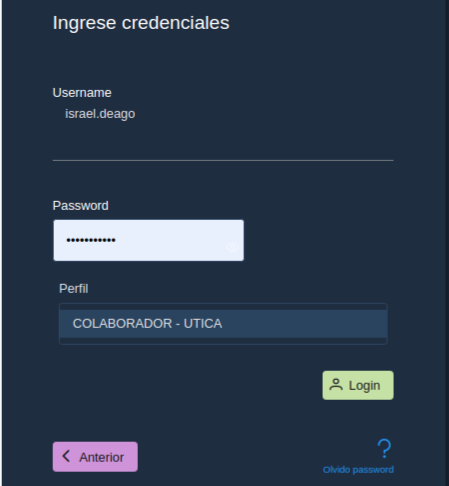

# 02. Login

Los usuarios del sistema tienen diversos roles con base en sus perfiles dentro de la institución.

A continuación se describe el procedimiento para ingreso al sistema o cambiar su password. Si usted no tiene un usuario habilitado o sus perfiles no son los indicados, comuníquese con el administrador del sistema.

## 02.01 Ingreso al sistema

Introduzca el usuario y presione el botón siguiente

En la siguiente sección ingrese el password y presione el botón Login, observe que se muestra el perfil que tiene asignado.
Si posee otro perfil haga clic sobre el para que se utilice este perfil en su sesión.

Al validar sus credenciales será dirigido al dashboard principal del sistema.

## 02.02 Olvido password

Si no logra recordar su password de clic en el botón Olvido password

A continuación ingrese su correo y presione el botón Token, para que el token sea enviado a su correo.

Se envía una notificación que se ha realizado de manera exitosa el envió de token a su correo.

Ingrese a su correo y copie el token que se ha enviado, puede observar que tiene un límite de tiempo para ser usado, en caso de que este tiempo se haya vencido deberá generar otro token y repetir el proceso.

Escriba el token recibido y presione el botón Validar, si es válido y se mantiene dentro del tiempo de vigencia será enviado al formulario para cambiar el password.

En el formulario para cambiar token ingresé el password y repítalo en la casilla a la derecha, automáticamente se validará las siguientes condiciones:
* Al menos 9 caracteres
* Al menos una letra minúscula
* Al menos una letra mayúscula
* Al menos un número
* Al menos un carácter @#.$%*_?

Una vez cambiado, el password será redirigido a la ventana de login para que ingrese con sus credenciales.

