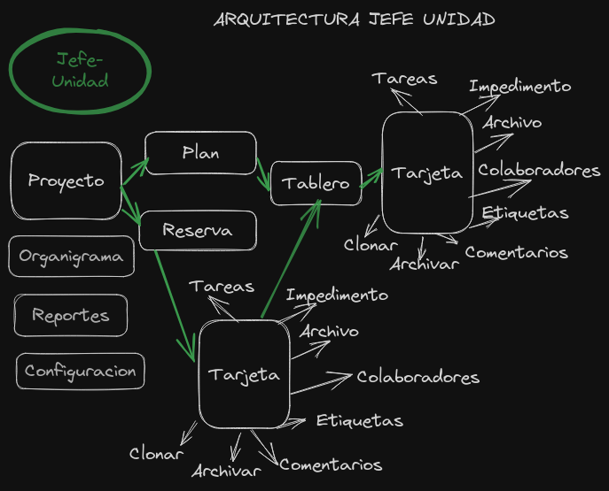
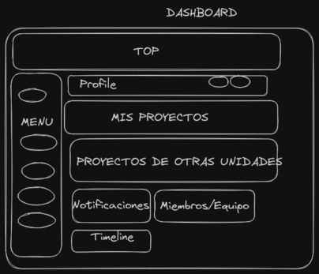
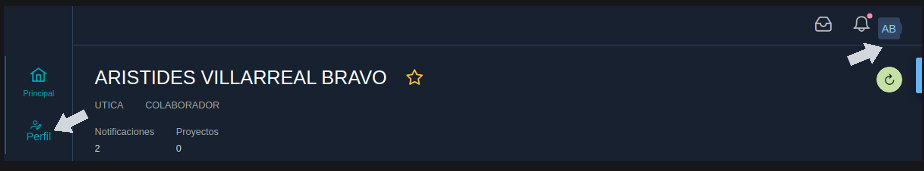
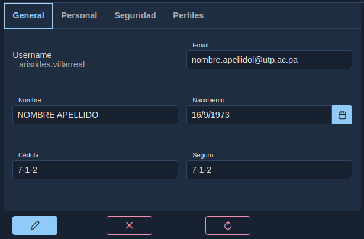
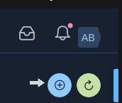
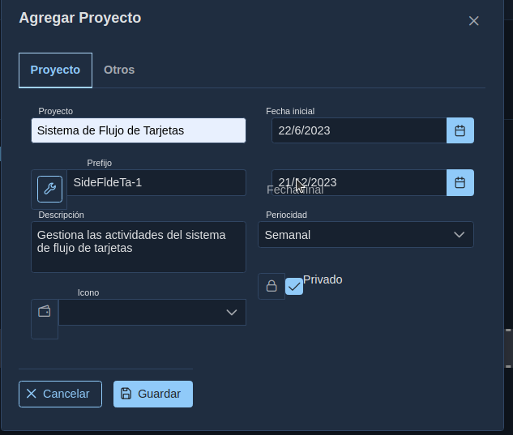
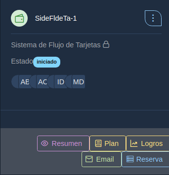

# 03.  Manual Jefe de Unidad

## Introducción

El sistema de flujo y gestión de tarjetas es una aplicación que se utiliza para gestionar proyectos y dar seguimiento a las acciones que deben ser realizar para cumplir con los requerimientos del proyecto.

Está orientado a equipos organizados que realizan trabajos basados en metas y objetivos claramente definidos. Ya que se requerirá establecer una planeación en periodos fijos de tiempo para alcanzar objetivos establecidos.

## Descargo de Responsabilidad

El sistema no está orientado a equipos que no están organizados ni a equipos que no realizan planeación de actividades. 
Para equipos sin planeación o seguimiento de actividades, esta herramienta no es la solución recomendada.

## Objetivos

* Identificar los requerimientos de manera oportuna
* Registrar las actividades que desarrollan diariamente
* Dar seguimiento al trabajo de los colaboradores 
* Identificar necesidades 
* Registrar los impedimentos que afectan las labores
* Establecer un canal de comunicación entre departamentos
* Estudiar el comportamiento de actividades y realizar predicciones sobre el mismo.
* Conocer en tiempo real el estado de las actividades

## Arquitecura Modular

La arquitectura modular para el jefe de unidad consiste de las acciones que él puede realizar sobre los diferentes componentes con el objetivo de alcanzar la funcionalidad esperada. A continuación se definen brevemente los componentes y pasos:
1. El jefe de unidad administra los proyectos.
2. Administra los planes de trabajo que no es más que los objetivos que se esperan alcanzar en intervalos de tiempo fijos.
3. Administra la Reserva que es una lista de solicitudes y eventos que deben ser ejecutados por los colaboradores una vez se definan los planes donde se deben realizar.
4. Una vez que exista un plan abierto en las fechas válidas, se puede dirigir al tablero donde puede crear y administrar las tarjetas.
5. Es importante que una vez terminado el plan(fecha de vencimiento), debe generar un plan nuevo para que los colaboradores puedan interactuar con el tablero.
6. El tablero es la unidad de gestión principal donde se podrán gestionar las tarjetas.
7. El sistema cuenta con una serie de informes que permiten consultar información de los eventos ocurridos.
8. Puede gestionar el organigrama donde establecerá los departamentos y sub departamentos estos son requisitos para los reportes.
9, En la configuración puede gestionar los tipos de tarjetas.

## 03.00 Dashboard

El diseño arquitectónico del sistema incluye en el Dashboard principal  los siguientes elementos que serán desplegados con base en los privilegios que posea el usuario dentro del sistema.

Al ingresar al sistema la primera vez , se puede encontrar con un dashboard vacio, esto indica que aun no se ha creado ningun proyecto con el que usted pueda trabajar.

Puede verificar que debajo de su nombre se muestra el perfil con el que ingreso al sistema.

Debajo de su nombre y perfil se mostrarán los proyectos en los que usted puede trabajar, en la parte inferior, donde se muestra el mensaje de Otras Unidades, se refiere a proyectos en los que usted no es miembro, pero que han sido establecidos como proyectos abiertos, y usted podrá crear acciones en ellos con ciertas limitaciones. Estos tipos de proyectos serán descritos más adelante.

## 03.01 Cambiar perfil

Usted puede cambiar datos generales de su perfil como nombre, teléfonos, fotos, password, entre otros, solo haciendo clic en el menú izquierdo Perfil o en la parte superior donde se muestran las iniciales de su nombre.

Cambie los datos que considere necesario de su perfil.
La  unidad y rol, solo pueden ser cambiados por el administrador del sistema, en caso de requerir esos cambios debe comunicarse con él.

En la pestaña **Otros** puede indicar los colaboradores, departamentos y áreas,además de indicar si el colaborador puede o no crear tarjetas.

## 03.02 Proyectos

Un proyecto en el sistema de flujo de tarjetas es la unidad de gestión que permite definir una serie de componentes y sus acciones a realizarse con la finalidad de lograr alcanzar objetivos definidos.
Estos proyectos deben ser asignados a uno o más departamentos, deben estar ubicados en una o más áreas. 
Los proyectos deben establecer una fecha de inicio y de fin, además de los colaboradores y propietarios del mismo.

Los proyectos se administran desde el dashboard principal y pueden ser privados o públicos.
En un proyecto privado tiene un alcance visible solo para los colaboradores y propietarios del mismo. Un colaborador de un proyecto privado solo puede ver las tarjetas que el mismo ha creado o que otro colaborador o jefe ha asignado.
En un proyecto público cualquier colaborador que no este asignado puede generar tarjetas con ciertas restricciones que una vez asignado al colaborador él puede interactuar con ellas.
Un propietario de un proyecto puede indicar si un colaborador puede o no crear tarjetas.
Los proyectos permiten gestionar un prefijo y un icono que ayuda a una rápida identificación del mismo.

### 03.02.01 Crear Proyecto

Para crear un proyecto de clic en el botón, para crear nuevos proyectos

Se habilita un diálogo donde usted puede agregar los elementos generales y específicos del proyecto
El botón al lado del prefijo genera un valor secuencial para las siglas del proyecto para evitar la duplicidad de prefijos.

En la pestaña **Otros** puede indicar los colaboradores, departamentos y áreas,además de indicar si el colaborador puede o no crear tarjetas.

Al buscar colaboradores o departamentos o áreas usted puede escribir el texto, este iniciara la búsqueda a partir del tercer carácter, si selecciona el botón de flecha se buscarán todos.

Una vez creado el proyecto nos aparece en el panel principal
Se puede observar que es un proyecto privado por el icono del candado cerrado y aparecen habilitados los botones Resumen, Plan, Logros, Email, Reserva.

## Plan

Es una iteración con un tiempo fijo establecido , generalmente 2 semanas o el tiempo que el equipo de trabajo acuerda.
En este periodo de trabajo el equipo estará realizando las actividades acordadas con el jefe de unidad  precisamente.
El sprint divide los requerimientos en pequeñas partes para que puedan ser realizadas  y medidas con mayor facilidad.

## Tablero
Es una herramienta visual que permite visualizar todo el trabajo que realiza el equipo en base a columnas.
Estas columnas representan las etapas en que se van realizando las diversas actividades.
Promueve la transparencia, comunicación y colaboración del equipo.

## Reserva
Es una lista de las actividades a realizarse como parte del proyecto, pero que no se ha especificado el tiempo en que se deban realizar.
Estas son agregadas a los sprint en base al desarrollo de las actividades del proyecto.

## Tarjeta
Una tarjeta define requerimientos  en término de las necesidades de los usuarios. 
 Una tarjeta indica la actividad a realizarse, quién o quienes la ejecutan, así como las tareas, impedimentos, comentarios, archivos, etiquetas que acompañan a la misma para describir de manera clara la actividad.

## Proyectos Foraneos
