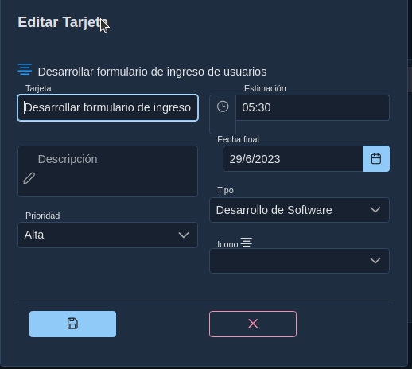

# 03.  Manual Jefe de Unidad

Sistema de Flujo de Tarjetas

## Introducción

El sistema de flujo y gestión de tarjetas es una aplicación que se utiliza para gestionar proyectos y dar seguimiento a las acciones que deben ser realizar para cumplir con los requerimientos del proyecto.

Está orientado a equipos organizados que realizan trabajos basados en metas y objetivos claramente definidos. Ya que se requerirá establecer una planeación en periodos fijos de tiempo para alcanzar objetivos establecidos.

## Descargo de Responsabilidad

El sistema no está orientado a equipos que no están organizados ni a equipos que no realizan planeación de actividades. 
Para equipos sin planeación o seguimiento de actividades, esta herramienta no es la solución recomendada.

## Objetivos Generales

* Identificar los requerimientos de manera oportuna
* Registrar las actividades que desarrollan diariamente
* Dar seguimiento al trabajo de los colaboradores 
* Identificar necesidades 
* Registrar los impedimentos que afectan las labores
* Establecer un canal de comunicación entre departamentos
* Estudiar el comportamiento de actividades y realizar predicciones sobre el mismo.
* Conocer en tiempo real el estado de las actividades

## Acerca del manual

Este manual es una, guia para los jefes de unidad de como elaborar proyectos y dar seguimiento a las actividades realizadas por sus colaboradores.
Está elaborado con los pasos a seguir en diversas situaciones, además encontrará recomendaciones y  sobre acciones a tomar en base a los diversos eventos que pueden generarse con la utilización del sistema.
El sistema está diseñado para utilizarse desde un navegador Web, se recomienda el uso de Google Chrome, también puede utilizarlo desde un dispositivo móvil, teniendo en cuenta que por las dimensiones del mismo se hacen ajustes en la visualización de los componentes.

---

## Arquitecura Modular

El siguiente diagrama muestra la arquitectura modular de componentes que hemos diseñado para el módulo de jefe de unidad, si usted da seguimiento al flujo de procesos le ayudará a comprender con mayor facilidad las funcionalidades del sistema.

La arquitectura modular para el jefe de unidad consiste de las acciones que él puede realizar sobre los diferentes componentes con el objetivo de alcanzar la funcionalidad esperada. A continuación se definen brevemente los componentes y pasos:
1. El jefe de unidad administra los proyectos.
2. Administra los planes de trabajo que no es más que los objetivos que se esperan alcanzar en intervalos de tiempo fijos.
3. Administra la Reserva que es una lista de solicitudes y eventos que deben ser ejecutados por los colaboradores una vez se definan los planes donde se deben realizar.
4. Una vez que exista un plan abierto en las fechas válidas, se puede dirigir al tablero donde puede crear y administrar las tarjetas.
5. Es importante que una vez terminado el plan(fecha de vencimiento), debe generar un plan nuevo para que los colaboradores puedan interactuar con el tablero.
6. El tablero es la unidad de gestión principal donde se podrán gestionar las tarjetas.
7. El sistema cuenta con una serie de informes que permiten consultar información de los eventos ocurridos.
8. Puede gestionar el organigrama donde establecerá los departamentos y sub departamentos estos son requisitos para los reportes.  
9. En la configuración puede gestionar los tipos de tarjetas. 
10. Se contará con sistema de IA integrado que estará analizando el comportamiento de los colaboradores para generar advertencias y recomendaciones sobre las acciones realizadas o que deben ser realizadas, además de predicciones que le ayudarán a la toma de decisiones. 

---

## 03.00 Dashboard

El diseño arquitectónico del sistema incluye en el Dashboard principal  los siguientes elementos que serán desplegados con base en los privilegios que posea el usuario dentro del sistema.

Al ingresar al sistema la primera vez , se puede encontrar con un dashboard vacio, esto indica que aun no se ha creado ningun proyecto con el que usted pueda trabajar.

Puede verificar que debajo de su nombre se muestra el perfil con el que ingreso al sistema.

Debajo de su nombre y perfil se mostrarán los proyectos en los que usted puede trabajar, en la parte inferior, donde se muestra el mensaje de Otras Unidades, se refiere a proyectos en los que usted no es miembro, pero que han sido establecidos como proyectos abiertos, y usted podrá crear acciones en ellos con ciertas limitaciones. Estos tipos de proyectos serán descritos más adelante.

## 03.01 Cambiar perfil

Usted puede cambiar datos generales de su perfil como nombre, teléfonos, fotos, password, entre otros, solo haciendo clic en el menú izquierdo Perfil o en la parte superior donde se muestran las iniciales de su nombre.

Cambie los datos que considere necesario de su perfil.
La  unidad y rol, solo pueden ser cambiados por el administrador del sistema, en caso de requerir esos cambios debe comunicarse con él.

En la pestaña **Otros** puede indicar los colaboradores, departamentos y áreas,además de indicar si el colaborador puede o no crear tarjetas.

---

## 03.02 Proyectos

Un proyecto en el sistema de flujo de tarjetas es la unidad de gestión que permite definir una serie de componentes y sus acciones a realizarse con la finalidad de lograr alcanzar objetivos definidos.
Estos proyectos deben ser asignados a uno o más departamentos, deben estar ubicados en una o más áreas. 
Los proyectos deben establecer una fecha de inicio y de fin, además de los colaboradores y propietarios del mismo.

Los proyectos se administran desde el dashboard principal y pueden ser privados o públicos.
En un proyecto privado tiene un alcance visible solo para los colaboradores y propietarios del mismo. Un colaborador de un proyecto privado solo puede ver las tarjetas que el mismo ha creado o que otro colaborador o jefe ha asignado.
En un proyecto público cualquier colaborador que no este asignado puede generar tarjetas con ciertas restricciones que una vez asignado al colaborador él puede interactuar con ellas.
Un propietario de un proyecto puede indicar si un colaborador puede o no crear tarjetas.
Los proyectos permiten gestionar un prefijo y un icono que ayuda a una rápida identificación del mismo.

### 03.02.01 Crear Proyecto

Para crear un proyecto de clic en el botón, para crear nuevos proyectos

Se habilita un diálogo donde usted puede agregar los elementos generales y específicos del proyecto
El botón al lado del prefijo genera un valor secuencial para las siglas del proyecto para evitar la duplicidad de prefijos.

En la pestaña **Otros** puede indicar los colaboradores, departamentos y áreas,además de indicar si el colaborador puede o no crear tarjetas.

Al buscar colaboradores o departamentos o áreas usted puede escribir el texto, este iniciara la búsqueda a partir del tercer carácter, si selecciona el botón de flecha se buscarán todos.

Una vez creado el proyecto nos aparece en el panel principal
Se puede observar que es un proyecto privado por el icono del candado cerrado y aparecen habilitados los botones Resumen, Plan, Logros, Email, Reserva.

Los proyectos privados y públicos tendrán colores diferentes para diferenciarlos rápidamente.

---

## 03.03 Plan

Es una iteración con un tiempo fijo establecido, generalmente 2 semanas o el tiempo que el equipo de trabajo acuerda.
En este periodo de trabajo el equipo estará realizando las actividades acordadas con el jefe de unidad.
El plan divide los requerimientos en pequeñas acciones llamadas tarjetas que puedan ser medidas para generar estadística.
Un plan contendrá fecha de inicio y fin y los objetivos a alcanzarse.
Para utilizar el tablero es necesario contar con un plan abierto.
Cuando se cierra un plan se generan las estadísticas correspondientes.

### 03.03.01 Crear Plan

Como primer paso para trabajar en el proyecto necesitamos tener un plan abierto, por lo que haremos clic en el botón Plan del proyecto seleccionado.

Se muestra el formulario para administrar planes, puede observar que aún no se ha creado ningún plan por lo cual la lista estará vacía. Proceda a generar un nuevo plan haciendo clic sobre el botón (+) para crear un nuevo plan.

Proceda a indicar la fecha de inicio y fin del plan y defina los objetivos generales que desea alcanzar durante este periodo de tiempo.  Luego presione el botón Guardar.

Se muestra un registro del plan creado, en la parte superior se habilita el botón para realizar impresión de los planes, el botón al lado de impresión permite actualizar los registros con cambios que han realizado otros usuarios.

En la misma fila del plan que se generó, puede observar que se creó la nomenclatura automáticamente sp-1, a medida que usted cree nuevos planes se genera un valor secuencial. Es importante tener en cuenta que solo se puede tener un plan abierto a la vez por cada proyecto. Para generar un nuevo plan se debe cerrar el anterior si este se encuentra abierto. Se despliega un menú donde usted puede editar los datos del plan. Puede consultar las tarjetas una vez están se hayan generado, también puede ver una gráfica de totales de tarjetas en el tablero una vez se han generado las tarjetas, y puede cerrar el plan. Es fundamental que tenga presente que al cerrar un plan, es un proceso irreversible y no se puede deshacer.

A continuación de clic en botón Principal para regresar el dashboard principal y continuar trabajando con el proyecto.

---

## 03.04 Tablero
Es una herramienta visual que permite visualizar todo el trabajo que realiza el equipo con base en columnas.
Estas columnas representan las etapas en que se van ejecutando las diversas actividades.
Promueve la transparencia, comunicación y colaboración del equipo.

Desde el Dashboard principal en el proyecto deseado haga clic en el botón Tablero, recuerde que este botón solo se habilita si hay un **Plan** abierto para este proyecto.

El tablero muestra tres columnas **pendiente**, **progreso** y **finalizado**.
* La columna pendiente muestra las tarjetas que no se han iniciado y están planificadas para realizarse en este plan.
* La columna progresó muestra las tarjetas que se están trabajando.
* La columna finalizada muestra las tarjetas que han finalizado.

## 03.05 Tarjeta

* Una tarjeta define requerimientos en término de las necesidades de los usuarios. 
* Una tarjeta indica la actividad a realizarse, quién o quienes la ejecutan, así como las tareas, impedimentos, comentarios, archivos, etiquetas que acompañan a la misma para describir de manera clara la actividad.

Algunas consideraciones la creación de tarjetas:
1. Propietario del proyecto puede crear tarjetas desde el tablero.
2. El colaborador puede generar tarjetas siempre y cuando el proyecto se estableció que el colaborador puede crear sus tarjetas.
3. Un colaborador externo puede generar tarjetas en el tablero con restricciones si es un proyecto abierto.
4. El colaborador podrá ver tarjetas que se le han asignado por los propietarios del proyecto creándolas desde el tablero o pasándolas desde la Reserva.
5. Un colaborador en un proyecto de tipo privado podrá solo ver sus tarjetas.
6. Un colaborador en un proyecto de tipo público podrá ver todas las tarjetas de ese proyecto, ya que existirán tarjetas que producen colaboradores foráneos al proyecto.

### 03.05.01 Crear Tarjeta

Proceda a crear una nueva tarjeta haciendo clic en el botón (+)

Se muestra el formulario donde podrá ingresar información específica sobre la nueva tarjeta, tales como tarjeta, tipo de tarjeta, prioridad, fecha final y la estimación.
Descripción de los elementos:  
**Tarjeta**: Es la acción a ejecutar, recomendación usar verbos para describir en forma breve la acción:
"Desarrollar formulario de ingreso de usuarios"  
**Tipo tarjeta**: Es la categoría donde estará asignada la acción, si no aparece en el listado el jefe de unidad puede crear nuevos tipos desde la opción Configuración--> Tipo tarjetas desde el menú principal.  
**Prioridad**: Indica el tipo de prioridad que se asigne a la tarjeta. Cada prioridad muestra un color de fondo diferente para cada tarjeta, de manera que se pueda identificar más rápidamente.  
**Fecha Final**: Es la fecha en que debe estar finalizando dicha tarea.  
**Estimación**": Es la estimación en horas y minutos **(99:99)** en la que debería llevarse a cabo la tarea. Ejemplo: 05:45 indica que esta tarea se debe realizar aproximadamente en 5 horas y 45 minutos. Rellene con ceros a la izquierda para completar dos dígitos de la hora y dos dígitos de los minutos.  

Luego de ingresar los datos, presione el botón Guardar, la tarjeta creada se muestra en la columna **pedientes**..  
Se puede observar que automáticamente se asignó como colaborador al usuario que creo la tarjeta, se asigna un icono de manera predeterminada, se muestra la duración en días para que finalice la tarjeta.(Esta duración no debe exceder la fecha final del plan).
Se habilita un menú desplegable (....) y en la parte inferior un botón para mover la tarjeta hacia la columna de progreso.

### 03.05.02 Cambiar nombre de la tarjeta

Para cambiar el nombre de la tarjeta se puede realizar de manera rápida dando doble clic en el nombre de la tarjeta, se habilitará el texto para que escriba sobre él y luego presione el botón de confirmación para aceptar los cambios.

De clic en el menú(...) para desplegar las diversas acciones que puede ejecutar sobre la tarjeta  
  

### 03.05.03 Editar Tarjeta

Se muestra el formulario para editar la tarjeta

Editar tarjeta permite hacer cambios a la tarjeta en los atributos: tarjeta, tipo de tarjeta, estimación, descripción, fecha final, prioridad e icono.
Es recomendable ingresar una descripción general que indique el tipo de trabajo a realizar en esta tarjeta. En el ejemplo agregamos una descripción y cambiamos el icono. 
Una vez finalizado los cambios, presioné el botón Guardar

Al dar clic en editar podemos observar los cambios realizados a la tarjeta.

  

### 03.05.04 Agregar Colaborador

Desde el menú de la tarjeta seleccioné la opción Colaborador

Es posible agregar o quitar colaboradores de la tarjeta, siempre y cuando estos colaboradores se hayan agregado previamente al proyecto.
Solo debe dar doble clic en la casilla de selección del colaborador y una vez marcados los colaboradores, haga clic en el botón Guardar. 
Para remover un colaborador solo tiene que desmarcar la casilla.

Se puede observar que aparece el nuevo colaborador agregado a la tarjeta. Se mostrará la foto del colaborador que agrego desde su perfil o en caso de no poseer foto se generará un avatar con las siglas de su nombre. Usted puede colocar el mouse sobre el avatar y mostrará el nombre completo del colaborador.
No hay límites en la cantidad de colaboradores que pueden estar asignados a una tarjeta.

### 03.05.05 Tarea

Una **tarea** es una unidad de trabajo necesaria para culminar la realización de una tarjeta. 

Desde el menú de la tarjeta seleccioné la opción Tarea

Ingrese la tarea a realizar y presione el botón (+), se agregará a la lista de tareas.

Se muestra la tarea, presioné el botón cerrar para confirmar los cambios en la tarea. Usted puede agregar múltiples tareas y también eliminarlas presionando el botón (x)

En la tarjeta se muestra información del número de tareas pendientes /tareas totales. Agregue nuevas tareas a la tarjeta.

En la tarjeta se muestra información del número de tareas pendientes /tareas totales. Agregue nuevas tareas a la tarjeta haciendo clic en la casilla de total de tareas o desde el menú Tareas.

### 03.05.06 Mover tarjetas

Proceda a mover la tarjeta a la columna de progreso haciendo clic en el botón (-.>) en la parte inferior de la tarjeta.

Se muestra la columna progreso con la tarjeta.

Usted no podrá mover tarjetas a la columna finalizada hasta que no haya completado las tareas.

Cuando una tarjeta está en la columna progreso, esta puede ser regresada a la columna **pendiente** o avanzar a la columna **finalizado**

### 03.05.06 Marcar terminada una tarea

Para indicar que ha finalizado una  tarea, abra el diálogo de tarea de la tarjeta y marque la casilla de selección y presione el botón cerrar.
Las tareas que se marquen como terminadas se mostraran de color verde la próxima vez que ingrese.

Se actualiza, automáticamente, el contador de tarea pendiente

si regresa nuevamente al diálogo se mostrará en color verde la tarea terminada

proceda a marcar la otra tarea como finalizada.

Se puede observar que ya no tenemos tareas pendientes 0/2 y es posible mover la tarjeta a la columna finalizada.

### 03.05.06 Clonar

Clonar una tarjeta es el proceso mediante el cual se crea una nueva tarjeta a partir de una creada previamente.

Desde el menú de la tarjeta seleccioné la opción Clonar

El formulario muestra el nombre anterior de la tarjeta desde la cual se va a realizar la clonación, reemplace el nombre por uno nuevo y presione el botón Clonar, los elementos de la tarjeta serán copiados a esta nueva tarjeta.  
**Ejemplo**: Crear opciones de menú

Proceda a editar la imagen y cámbiele la prioridad a **Media** y el icono y guarde los cambios.

La tarjeta cambiará de color basándose en la prioridad establecida.

### 03.05.07 Archivar 

Desde el menú de la tarjeta seleccioné la opción Archivar

### 03.05.08 Comentario  

Desde el menú de la tarjeta seleccioné la opción Comentario

### 03.05.09 Impedimiento

Desde el menú de la tarjeta seleccioné la opción Impedimento

### 03.05.10 Etiqueta

Desde el menú de la tarjeta seleccioné la opción Etiqueta

### 03.05.11 Archivo

Desde el menú de la tarjeta seleccioné la opción Archivo

### 03.05.12 Desplazamientos

### 03.05.13 Tarjetas editadas por otros ususarios

---

### 03.06 Graficas
### 03.07 Tarjetas
### 03.08 Cronologia

---

## Reserva
Es una lista de las actividades a realizarse como parte del proyecto, pero que no se ha especificado el tiempo en que se deban realizar.
Estas son agregadas a los sprint en base al desarrollo de las actividades del proyecto.

## Proyectos Foraneos

## Editar proyecto

