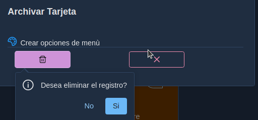
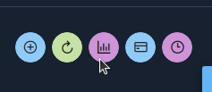

# 03.  Manual Jefe de Unidad

Sistema de Flujo de Tarjetas


## Introducción

El sistema de flujo y gestión de tarjetas es una aplicación que se utiliza para gestionar proyectos y dar seguimiento a las acciones que deben ser realizar para cumplir con los requerimientos del proyecto.

Está orientado a equipos organizados que realizan trabajos basados en metas y objetivos claramente definidos. Ya que se requerirá establecer una planeación en periodos fijos de tiempo para alcanzar objetivos establecidos.


## Descargo de Responsabilidad

El sistema no está orientado a equipos que no están organizados ni a equipos que no realizan planeación de actividades. 
Para equipos sin planeación o seguimiento de actividades, esta herramienta no es la solución recomendada.


## Objetivos Generales

* Identificar los requerimientos de manera oportuna
* Registrar las actividades que desarrollan diariamente
* Dar seguimiento al trabajo de los colaboradores 
* Identificar necesidades 
* Registrar los impedimentos que afectan las labores
* Establecer un canal de comunicación entre departamentos
* Estudiar el comportamiento de actividades y realizar predicciones sobre el mismo.
* Conocer en tiempo real el estado de las actividades

## Acerca del manual

Este manual es una, guia para los jefes de unidad de como elaborar proyectos y dar seguimiento a las actividades realizadas por sus colaboradores.
Está elaborado con los pasos a seguir en diversas situaciones, además encontrará recomendaciones y  sobre acciones a tomar en base a los diversos eventos que pueden generarse con la utilización del sistema.
El sistema está diseñado para utilizarse desde un navegador Web, se recomienda el uso de Google Chrome, también puede utilizarlo desde un dispositivo móvil, teniendo en cuenta que por las dimensiones del mismo se hacen ajustes en la visualización de los componentes.


---

## Arquitectura Modular

El siguiente diagrama muestra la arquitectura modular de componentes que hemos diseñado para el módulo de jefe de unidad, si usted da seguimiento al flujo de procesos le ayudará a comprender con mayor facilidad las funcionalidades del sistema.


La arquitectura modular para el jefe de unidad consiste de las acciones que él puede realizar sobre los diferentes componentes con el objetivo de alcanzar la funcionalidad esperada. A continuación se definen brevemente los componentes y pasos:
1. El jefe de unidad administra los proyectos.
2. Administra los planes de trabajo que no es más que los objetivos que se esperan alcanzar en intervalos de tiempo fijos.
3. Administra la Reserva que es una lista de solicitudes y eventos que deben ser ejecutados por los colaboradores una vez se definan los planes donde se deben realizar.
4. Una vez que exista un plan abierto en las fechas válidas, se puede dirigir al tablero donde puede crear y administrar las tarjetas.
5. Es importante que una vez terminado el plan(fecha de vencimiento), debe generar un plan nuevo para que los colaboradores puedan interactuar con el tablero.
6. El tablero es la unidad de gestión principal donde se podrán gestionar las tarjetas.
7. El sistema cuenta con una serie de informes que permiten consultar información de los eventos ocurridos.
8. Puede gestionar el organigrama donde establecerá los departamentos y sub departamentos estos son requisitos para los reportes.  
9. En la configuración puede gestionar los tipos de tarjetas. 
10. Se contará con sistema de IA integrado que estará analizando el comportamiento de los colaboradores para generar advertencias y recomendaciones sobre las acciones realizadas o que deben ser realizadas, además de predicciones que le ayudarán a la toma de decisiones. 

---
## Etapas  

Este manual se divide en 4 etapas 

# Etapa I
  * Conocer el dashboard principal
  * Editar el perfil
  * Crear un proyecto
  * Crear un plan de trabajo
  * Entender el uso del tablero
  * Crear tarjetas y sus elementos
  * Que hacer cuando otro usuario modifica nuestra tarjeta
  * Ver gráficas
  * Listado de tarjetas del plan
  * Cronología


# Etapa II
  * Editar proyecto
  * Resumen del proyecto
  * Cerrar el plan
  * Logros 
  * Tarjetas por Plan
  * Gráfica del plan
  * Imprimir plan
  * Crear plan después de cerrado
  * Editar plan
  

# Etapa III
  * Email 
  * Reserva
  * Clonar
  * Configuración tipos de tarjetas
  * Proyectos Foráneos

# Etapa IV
  * Mis reportes
  * Organigrama 
  * Reportes Departamentales
  * Reportes por Colaborador


---
# Etapa I
  * Conocer el dashboard principal
  * Editar el perfil
  * Crear un proyecto
  * Crear un plan de trabajo
  * Entender el uso del tablero
  * Crear tarjetas y sus elementos
  * Que hacer cuando otro usuario modifica nuestra tarjeta
  * Ver gráficas
  * Listado de tarjetas del plan
  * Cronología


## 03.00 Dashboard

El diseño arquitectónico del sistema incluye en el Dashboard principal  los siguientes elementos que serán desplegados con base en los privilegios que posea el usuario dentro del sistema.


Al ingresar al sistema la primera vez , se puede encontrar con un dashboard vacio, esto indica que aun no se ha creado ningun proyecto con el que usted pueda trabajar.


Puede verificar que debajo de su nombre se muestra el perfil con el que ingreso al sistema.

Debajo de su nombre y perfil se mostrarán los proyectos en los que usted puede trabajar, en la parte inferior, donde se muestra el mensaje de Otras Unidades, se refiere a proyectos en los que usted no es miembro, pero que han sido establecidos como proyectos abiertos, y usted podrá crear acciones en ellos con ciertas limitaciones. Estos tipos de proyectos serán descritos más adelante.


## 03.01 Cambiar perfil

Usted puede cambiar datos generales de su perfil como nombre, teléfonos, fotos, password, entre otros, solo haciendo clic en el menú izquierdo Perfil o en la parte superior donde se muestran las iniciales de su nombre.


Cambie los datos que considere necesario de su perfil.
La  unidad y rol, solo pueden ser cambiados por el administrador del sistema, en caso de requerir esos cambios debe comunicarse con él.


## 03.02 Proyectos

Un proyecto en el sistema de flujo de tarjetas es la unidad de gestión que permite definir una serie de componentes y sus acciones a realizarse con la finalidad de lograr alcanzar objetivos definidos.
Estos proyectos deben ser asignados a uno o más departamentos, deben estar ubicados en una o más áreas. 
Los proyectos deben establecer una fecha de inicio y de fin, además de los colaboradores y propietarios del mismo.

Los proyectos se administran desde el dashboard principal y pueden ser privados o públicos.
En un proyecto privado tiene un alcance visible solo para los colaboradores y propietarios del mismo. Un colaborador de un proyecto privado solo puede ver las tarjetas que el mismo ha creado o que otro colaborador o jefe ha asignado.
En un proyecto público cualquier colaborador que no este asignado puede generar tarjetas con ciertas restricciones que una vez asignado al colaborador él puede interactuar con ellas.
Un propietario de un proyecto puede indicar si un colaborador puede o no crear tarjetas.
Los proyectos permiten gestionar un prefijo y un icono que ayuda a una rápida identificación del mismo.

### 03.02.01 Crear Proyecto

Para crear un proyecto de clic en el botón, para crear nuevos proyectos


Se habilita un diálogo donde usted puede agregar los elementos generales y específicos del proyecto
El botón al lado del prefijo genera un valor secuencial para las siglas del proyecto para evitar la duplicidad de prefijos.


En la pestaña **Otros** puede indicar los colaboradores, departamentos y áreas,además de indicar si el colaborador puede o no crear tarjetas.


Al buscar colaboradores o departamentos o áreas usted puede escribir el texto, este iniciara la búsqueda a partir del tercer carácter, si selecciona el botón de flecha se buscarán todos.

Los colaboradores asignados al proyecto reciben un correo de notificación.

Una vez creado el proyecto nos aparece en el panel principal.
Se puede observar que es un proyecto privado por el icono del candado cerrado y aparecen habilitados los botones Resumen, Plan, Logros, Email, Reserva.


Los proyectos privados y públicos tendrán colores diferentes para diferenciarlos rápidamente.

---

## 03.03 Plan

Es una iteración con un tiempo fijo establecido, generalmente 2 semanas o el tiempo que el equipo de trabajo acuerda.
En este periodo de trabajo el equipo estará realizando las actividades acordadas con el jefe de unidad.
El plan divide los requerimientos en pequeñas acciones llamadas tarjetas que puedan ser medidas para generar estadística.
Un plan contendrá fecha de inicio y fin y los objetivos a alcanzarse.
Para utilizar el tablero es necesario contar con un plan abierto.
Cuando se cierra un plan se generan las estadísticas correspondientes.


### 03.03.01 Crear Plan

Como primer paso para trabajar en el proyecto necesitamos tener un plan abierto, por lo que haremos clic en el botón Plan del proyecto seleccionado.


Se muestra el formulario para administrar planes, puede observar que aún no se ha creado ningún plan por lo cual la lista estará vacía. Proceda a generar un nuevo plan haciendo clic sobre el botón (+) para crear un nuevo plan.


Proceda a indicar la fecha de inicio y fin del plan y defina los objetivos generales que desea alcanzar durante este periodo de tiempo.  Luego presione el botón Guardar.


Se muestra un registro del plan creado, en la parte superior se habilita el botón para realizar impresión de los planes, el botón al lado de impresión permite actualizar los registros con cambios que han realizado otros usuarios.

En la misma fila del plan que se generó, puede observar que se creó la nomenclatura automáticamente sp-1, a medida que usted cree nuevos planes se genera un valor secuencial. Es importante tener en cuenta que solo se puede tener un plan abierto a la vez por cada proyecto. Para generar un nuevo plan se debe cerrar el anterior si este se encuentra abierto. Se despliega un menú donde usted puede editar los datos del plan. Puede consultar las tarjetas una vez están se hayan generado, también puede ver una gráfica de totales de tarjetas en el tablero una vez se han generado las tarjetas, y puede cerrar el plan. Es fundamental que tenga presente que al cerrar un plan, es un proceso irreversible y no se puede deshacer.


A continuación de clic en botón Principal para regresar el dashboard principal y continuar trabajando con el proyecto.


---


## 03.04 Tablero

Es una herramienta visual que permite visualizar todo el trabajo que realiza el equipo con base en columnas.
Estas columnas representan las etapas en que se van ejecutando las diversas actividades.
Promueve la transparencia, comunicación y colaboración del equipo.

Desde el Dashboard principal en el proyecto deseado haga clic en el botón Tablero, recuerde que este botón solo se habilita si hay un **Plan** abierto para este proyecto.


El tablero muestra tres columnas **pendiente**, **progreso** y **finalizado**.
* La columna pendiente muestra las tarjetas que no se han iniciado y están planificadas para realizarse en este plan.
* La columna progresó muestra las tarjetas que se están trabajando.
* La columna finalizada muestra las tarjetas que han finalizado.


## 03.05 Tarjeta

* Una tarjeta define requerimientos en término de las necesidades de los usuarios. 
* Una tarjeta indica la actividad a realizarse, quién o quienes la ejecutan, así como las tareas, impedimentos, comentarios, archivos, etiquetas que acompañan a la misma para describir de manera clara la actividad.

Algunas consideraciones la creación de tarjetas:
1. Propietario del proyecto puede crear tarjetas desde el tablero.
2. El colaborador puede generar tarjetas siempre y cuando el proyecto se estableció que el colaborador puede crear sus tarjetas.
3. Un colaborador externo puede generar tarjetas en el tablero con restricciones si es un proyecto abierto.
4. El colaborador podrá ver tarjetas que se le han asignado por los propietarios del proyecto creándolas desde el tablero o pasándolas desde la Reserva.
5. Un colaborador en un proyecto de tipo privado podrá solo ver sus tarjetas.
6. Un colaborador en un proyecto de tipo público podrá ver todas las tarjetas de ese proyecto, ya que existirán tarjetas que producen colaboradores foráneos al proyecto.


### 03.05.01 Crear Tarjeta


Proceda a crear una nueva tarjeta haciendo clic en el botón (+)


Se muestra el formulario donde podrá ingresar información específica sobre la nueva tarjeta, tales como tarjeta, tipo de tarjeta, prioridad, fecha final y la estimación.
Descripción de los elementos:  
**Tarjeta**: Es la acción a ejecutar, recomendación usar verbos para describir en forma breve la acción:
"Desarrollar formulario de ingreso de usuarios"  
**Tipo tarjeta**: Es la categoría donde estará asignada la acción, si no aparece en el listado el jefe de unidad puede crear nuevos tipos desde la opción Configuración--> Tipo tarjetas desde el menú principal.  
**Prioridad**: Indica el tipo de prioridad que se asigne a la tarjeta. Cada prioridad muestra un color de fondo diferente para cada tarjeta, de manera que se pueda identificar más rápidamente.  
**Fecha Final**: Es la fecha en que debe estar finalizando dicha tarea.  
**Estimación**": Es la estimación en horas y minutos **(99:99)** en la que debería llevarse a cabo la tarea. Ejemplo: 05:45 indica que esta tarea se debe realizar aproximadamente en 5 horas y 45 minutos. Rellene con ceros a la izquierda para completar dos dígitos de la hora y dos dígitos de los minutos.  


Luego de ingresar los datos, presione el botón Guardar, la tarjeta creada se muestra en la columna **pedientes**..  
Se puede observar que automáticamente se asignó como colaborador al usuario que creo la tarjeta, se asigna un icono de manera predeterminada, se muestra la duración en días para que finalice la tarjeta.(Esta duración no debe exceder la fecha final del plan).
Se habilita un menú desplegable (....) y en la parte inferior un botón para mover la tarjeta hacia la columna de progreso.


### 03.05.02 Cambiar nombre de la tarjeta

Para cambiar el nombre de la tarjeta se puede realizar de manera rápida dando doble clic en el nombre de la tarjeta, se habilitará el texto para que escriba sobre él y luego presione el botón de confirmación para aceptar los cambios.


De clic en el menú(...) para desplegar las diversas acciones que puede ejecutar sobre la tarjeta  
  

### 03.05.03 Editar

Desde el menú de la tarjeta seleccioné la opción **Editar**

Se muestra el formulario para editar la tarjeta


Editar tarjeta permite hacer cambios a la tarjeta en los atributos: tarjeta, tipo de tarjeta, estimación, descripción, fecha final, prioridad e icono.
Es recomendable ingresar una descripción general que indique el tipo de trabajo a realizar en esta tarjeta. En el ejemplo agregamos una descripción y cambiamos el icono. 
Una vez finalizado los cambios, presioné el botón Guardar


Al dar clic en editar podemos observar los cambios realizados a la tarjeta.


  

### 03.05.04 Colaborador

Desde el menú de la tarjeta seleccioné la opción **Colaborador**


Es posible agregar o quitar colaboradores de la tarjeta, siempre y cuando estos colaboradores se hayan agregado previamente al proyecto.
Solo debe dar doble clic en la casilla de selección del colaborador y una vez marcados los colaboradores, haga clic en el botón Guardar. 
Para remover un colaborador solo tiene que desmarcar la casilla.


Se puede observar que aparece el nuevo colaborador agregado a la tarjeta. Se mostrará la foto del colaborador que agrego desde su perfil o en caso de no poseer foto se generará un avatar con las siglas de su nombre. Usted puede colocar el mouse sobre el avatar y mostrará el nombre completo del colaborador.
No hay límites en la cantidad de colaboradores que pueden estar asignados a una tarjeta.

Los colaboradores asignados a la tarjeta reciben un correo de notificación.

### 03.05.05 Tarea

Una **tarea** es una unidad de trabajo necesaria para culminar la realización de una tarjeta. 

Desde el menú de la tarjeta seleccioné la opción **Tarea**


Ingrese la tarea a realizar y presione el botón (+), se agregará a la lista de tareas.


Se muestra la tarea, presioné el botón cerrar para confirmar los cambios en la tarea. Usted puede agregar múltiples tareas y también eliminarlas presionando el botón (x)


En la tarjeta se muestra información del número de tareas pendientes /tareas totales. Agregue nuevas tareas a la tarjeta.


En la tarjeta se muestra información del número de tareas pendientes /tareas totales. Agregue nuevas tareas a la tarjeta haciendo clic en la casilla de total de tareas o desde el menú Tareas.


Si usted desea cambiar el texto de la tarea de doble clic sobre el nombre de la misma y escriba el texto deseado.


### 03.05.06 Mover tarjetas

Proceda a mover la tarjeta a la columna de progreso haciendo clic en el botón (-.>) en la parte inferior de la tarjeta.


Se muestra la columna progreso con la tarjeta.


Usted no podrá mover tarjetas a la columna finalizada hasta que no haya completado las tareas.

Cuando una tarjeta está en la columna progreso, esta puede ser regresada a la columna **pendiente** o avanzar a la columna **finalizado**


### 03.05.07 Marcar terminada una tarea

Para indicar que ha finalizado una  tarea, abra el diálogo de tarea de la tarjeta y marque la casilla de selección y presione el botón cerrar.
Las tareas que se marquen como terminadas se mostraran de color verde la próxima vez que ingrese.


Se actualiza, automáticamente, el contador de tarea pendiente


si regresa nuevamente al diálogo se mostrará en color verde la tarea terminada


proceda a marcar la otra tarea como finalizada.

Se puede observar que ya no tenemos tareas pendientes 0/2 y es posible mover la tarjeta a la columna finalizada.


### 03.05.08 Clonar

Clonar una tarjeta es el proceso mediante el cual se crea una nueva tarjeta a partir de una creada previamente.

Desde el menú de la tarjeta seleccioné la opción **Clonar**


El formulario muestra el nombre anterior de la tarjeta desde la cual se va a realizar la clonación, reemplace el nombre por uno nuevo y presione el botón Clonar, los elementos de la tarjeta serán copiados a esta nueva tarjeta.  
**Ejemplo**: Crear opciones de menú


Proceda a editar la imagen y cámbiele la prioridad a **Media** y el icono y guarde los cambios.


La tarjeta cambiará de color basándose en la prioridad establecida.


### 03.05.09 Archivar 
La opción de archivar nos permite remover una tarjeta del tablero y del proyecto.  Estas tarjetas no serán utilizadas nuevamente.

Desde el menú de la tarjeta seleccioné la opción **Archivar**



Si desea archivar la tarjeta presione el botón eliminar, se mostrará un diálogo solicitando confirmación de la acción. Tenga presente que este es un proceso no reversible.
Sí selecciona Archivar esta tarjeta será eliminada del tablero.


### 03.05.10 Comentario   
Los comentarios permiten definir información genérica que ayuda a entender procesos y eventos que están ocurriendo en una tarjeta. Además, es un medio para establecer un canal de comunicación entre los participantes de una tarjeta.


Desde el menú de la tarjeta seleccioné la opción **Comentario**


Para agregar un comentario, simplemente coloque el texto deseado y presione el botón (+)


Para agregar un comentario, simplemente coloque el texto deseado y presione el botón (+)
Usted puede editar el comentario agregado haciendo clic en el nombre del mismo o puede eliminarlo haciendo clic en el botón eliminar. 
Al finalizar de clic en el botón Cerrar.


En la parte inferior de la tarjeta se muestra el total de comentarios que se han creado para esa tarjeta, usted puede verlos haciendo clic en el botón que muestra el número de comentarios o mediante el menú (...) Comentarios  


### 03.05.11 Impedimiento  
Los impedimentos son eventos o requerimientos que afectan la realización de actividades para cumplir el objetivo establecido en la tarjeta.

Desde el menú de la tarjeta seleccioné la opción **Impedimento**


Registre el impedimento que esté afectando su labor de clic en el botón (+).


Presione el botón Cerrar para cargar los impedimentos a la tarjeta.


En la tarjeta se muestra el total de impedimentos, de manera que al hacer clic sobre el total de impedimentos o mediante el menú (...) Impedimento se puede mostrar el listado, permitiendo agregar, editar o eliminar los impedimentos de la tarjeta.


### 03.05.12 Etiqueta  

Las etiquetas se usan para establecer categorías de las tarjetas dentro del tablero, de manera que permitan su identificación de manera oportuna.

Desde el menú de la tarjeta seleccioné la opción **Etiqueta**

Puede observar que el formulario posee la misma funcionalidad que los formularios vistos con anterioridad, ingrese el texto de su etiqueta y presione el botón (+), una vez que este en la lista en la columna **Severidad**, de doble clic y se mostrara una lista de opciones que permiten establecer la severidad de su etiqueta que se convierte en un color para la misma dentro de la tarjeta.


Presione el botón Cerrar, y se muestra en el tablero la tarjeta con la etiqueta creada.


Usted puede editar, agregar y eliminar etiquetas ingresando desde el menú (...) Etiqueta.


### 03.05.13 Archivo

Los archivos pueden ser documentos e imágenes que ofrecen mayor información sobre la tarjeta o eventos relacionados con ella.

Desde el menú de la tarjeta seleccioné la opción **Archivo**


Se muestra en la lista el nombre del archivo, si usted desea puede dar doble clic sobre el nombre y lo puede editar. También se encuentra el botón Eliminar y el botón para descargar el archivo.


Haga clic en el botón cerrar para mostrar la tarjeta, puede observar la cantidad de archivos que posee la tarjeta.


---

### 03.05.15 Tarjetas editadas por otros ususarios

El tablero, una tarjeta puede ser editada de manera simultánea por varios colaboradores. Para conservar la integridad de la tarjeta y evitar que un colaborador escriba sobre los cambios de otro colaborador sin haberlos visto antes, se implementa un evento en el sistema que permite verificar si la tarjeta fue cambiada por otro colaborador mientras usted trabajaba en ella, de manera que al ocurrir esta situación usted recibirá una notificación informando que la tarjeta fue cambiada por otro usuario y es necesario que usted actualice el tablero primero para que obtenga la tarjeta actualizada con los cambios realizados por otro colaborador y ahora si podrá usted modificarla y se evita los conflictos de sincronización.


**Ejemplo 1**:
Colaborador Arístides e Israel ingresan cada uno a su sesión y ambos toman la misma tarjeta para agregar algún elemento.
Aristides edita la tarjeta cambiando la descripción y aún no ha presionado el botón guardar mientras Israel en su sesión agrega una nueva tarea y presiona el botón para guardar la tarea.
Cuando Aristides intente guardar sus cambios en la misma tarjeta, se envía el siguiente mensaje:


Proceda a cerrar el diálogo y queda en el formulario de edición, proceda a cerrar el formulario sin intentar guardar sus cambios, estos no será posible guardarlos, ya que afectaría la integridad de los datos.


Observe que cuando usted cierra un formulario este sincroniza con la base de datos y se puede observar en el contador de tareas que ahora en lugar de 2 tareas existe una tercera que fue creada por el colaborador Israel en su sesión.


**Ejemplo 2**:

Ahora imaginemos que mientras nosotros nos mantenemos en nuestro tablero, el colaborador Israel agrega una etiqueta la tarjeta. Aristides no ha actualizado su tablero y desea editar la tarjeta, se va a generar el mensaje:


Esto indica que mientras usted tenía el tablero abierto no había realizado ninguna acción sobre esta tarjeta, otro colaborador la modifico, por lo tanto, debemos obtener esa sincronización primero para poder trabajar con esta tarjeta.


Proceda a sincronizar su tablero en la parte superior de clic en el botón Actualizar, y su tablero se sincronizará con la base de datos y se mostrará con las últimas actualizaciones realizadas.


Puede observar que su tablero está actualizado, la tarjeta muestra la etiqueta que agrego el otro colaborador, y ahora podemos trabajar con esa tarjeta.


Lo explicado en esta sección muestra como se administra la sincronización de las tarjetas para mantener su integridad al ser utilizada por varios colaboradores.

---

### 03.06 Graficas

Las gráficas nos permiten visualizar el estado actual del tablero para el plan 
Actual. Permite identificar los totales de tarjetas en las columnas pendientes, 
progreso y finalizado.

De clic en el botón Gráfica en la parte superior del tablero   


Se observa la gráfica por cada columna indicando los totales de tarjetas.  


Para regresar al **tablero** en la parte superior izquierda de clic en Tablero


### 03.07 Tarjetas

Muestra un Listado de las tarjetas del plan actual, permitiendo imprimir el listado de las mismas.

De clic en el botón tarjetas en la parte superior del tablero  


Se muestra el listado de las tarjetas del plan, en la parte superior de la tabla puede imprimir las tarjetas presionando el botón Imprimir.  


Se despliega en otra pestaña del navegador su informe listo para ser impreso al presionar el botón Imprimir.  
  
Regrese a la pestaña donde se mantiene el sistema activo y de clic en el menú Tablero en la parte superior para regresar al tablero.


### 03.08 Cronología

Permite visualizar cronológicamente las tarjetas del plan actual. Para ayudar a la toma de decisiones.


Practique creando una nueva tarjeta llamada: **Pruebas de opciones de menú**. Mueva a la columna **finalizado** la tarjeta **Desarrollar formulario de ingreso de usuarios**, proceda a mover la tarjeta 
**Crear opciones de menú** a la columna **progreso** 


En la parte superior del tablero de clic sobre el botón cronología.  


Espere unos segundos mientras se procesa la información, se muestra la cronología por colaborador. Puede regresar al tablero haciendo clic en el botón Tablero en la parte superior del formulario.


Puede observar que las tarjetas en la columna **pendiente** se colocan de color rojo, las de la columna **progreso** en color amarillo y las que están en la columna finalizada se colocan de color **verde**.

Para regresar al tablero de clic en el botón **Tablero** en la parte superior izquierda.  


---
# Etapa II
  * Editar proyecto
  * Resumen del proyecto
  * Cerrar el plan
  * Logros 
  * Tarjetas por Plan
  * Gráfica del plan
  * Imprimir plan
  * Crear plan después de cerrado
  * Editar plan


## Editar Proyecto 

Desde el tablero dar clic en el enlace Principal en la esquina superior izquierda para regresar al dashboard principal.


Recuerde que este dashboard solo muestra proyectos que estén iniciados o detenidos. Haga clic sobre el botón (...) que aparece al lado del proyecto con el que esté trabajando.  Se mostrará un menú con las siguientes opciones:


Seleccione la opción editar y se visualizará un diálogo con tres pestañas para que usted puede editar el proyecto. En la pestaña **Proyecto** se muestra los datos generales del proyecto.


La pestaña **Calendario**, permite modificar las fechas de inicio, y fecha de fin y la periodicidad de los planes dentro del proyecto.


En la sección **Otros** puede seleccionar el propietario, colaborador, departamento, área y le permite indicar si el colaborador puede o no crear tarjetas.


Presione el botón Actualizar si ha realizado algún cambio o el botón Cerrar si no ha realizado cambios. En la edición de proyectos aplica el control de sincronización para garantizar la integridad de los proyectos con un comportamiento similar a las tarjetas.

**Ejemplo 1**:  
El usuario Aristides se encuentra en el dashboard principal, es propietario del proyecto y selecciona la opción Editar el proyecto. Al mismo tiempo otro usuario Angel ingresa al sistema y edita el proyecto guardando los cambios mientras Aristides aún no presionado el botón para guardar los cambios que ha realizado, cuando intenta guardarlos se genera la advertencia siguiente:


Proceda a cerrar el mensaje presionando en el botón (x) y luego presione el botón Cancelar del diálogo.
Ahora en la parte superior derecha presione el botón Actualizar para sincronizar el dashboard con los últimos cambios existentes en la base datos.


Ahora puede proceder a editar el proyecto, ya que se encuentra sincronizado con la base de datos.


Nota:
     Estado iniciado indica que el proyecto está activo. Puede cambiar el estado ha detenido indicando que no se puede realizar actividades sobre el proyecto, cuando la fecha final está vencida el propietario del proyecto debe editar el proyecto y colocar el estado cómo finalizado.
   Un proyecto con estado finalizado no se mostrará en el dashboard principal, solo se mostrará desde las opciones de reporte.


## Resumen del proyecto

 El resumen del proyecto muestra el total de planes, tarjetas pendientes en progreso y finalizados, además de las tarjetas que se encuentran en reserva.

Desde el dashboard principal seleccioné el proyecto y de clic en el botón **Resumen**, se muestra un diálogo con el resumen del proyecto. Esto le permitirá identificar el estado actual del plan.  


## Cerrar Plan

  Cerrar el plan es el proceso que debe realizar el propietario del proyecto con la finalidad de indicar que se han culminado el plan de trabajo establecido desde la fecha de inicio a la fecha de fin. 
Es importante que el propietario este al tanto de cerrar los planes, ya que los colaboradores no podrán registrar tarjetas si no hay plan activo en las fechas actuales. 
Si un plan no se ha cerrado y la fecha de vencimiento es menor que la fecha actual, el colaborador no podrá trabajar con el tablero.

Cuando se cierra un plan se realizan las operaciones de cálculo para determinar las estadísticas del plan y de los colaboradores.

Desde el dashboard principal ubíquese en el proyecto deseado y de clic en el botón **Plan**


En el listado que se muestra podrá observar que existe un plan con un icono de un candado abierto, esto indica que el proyecto aun está abierto, seleccione el menú (...) y de clic en la opción **Cerrar Plan**


En la sección **Comentario** ingrese detalles sobre el Plan, eventos relevantes que han ocurrido en el mismo y luego presione el botón **Cerrar Plan**, tenga presente que este proceso es irreversible y se generan estadísticas del plan y de los colaboradores asociados al plan.


Se despliega un diálogo para confirmar o no si desea cerrar el proyecto, presione el botón **Si** para proceder a cerrar el proyecto.


Se actualiza el listado de planes y puede observar que el icono del plan se muestra con un candado cerrado indicando que el plan fue cerrado.


Ahora regrese al dashboard principal haciendo clic en el botón **principal**


Cuando no hay proyectos abiertos no se muestra el botón **Tablero**, por lo tanto, como propietario del proyecto debe estar pendiente de la existencia un plan abierto para que se habilite el tablero.


## Logros

Los logros es la gráfica que muestra la estadística de todos los planes cerrados del proyecto, permitiendo al jefe de unidad tomar decisiones sobre el progreso del mismo a través del tiempo.

En el dashboard principal seleccione el proyecto deseado y presione el botón **Logros**


Puede ver la gráfica de totales y su porcentaje por plan y de las columnas pendientes, progreso y finalizado.


Regrese al menú principal dando clic en la opción principal del menú superior izquierdo

Nos muestra el formulario de tarjetas del plan, y si desea puede imprimirlas dando clic en botón Imprimir


Al dar clic en el botón imprimir se despliega en otra ventana el informe.


## Tarjetas Por plan

Para visualizar las tarjetas del plan realicé el siguiente procedimiento:

Desde el dashboard principal seleccioné el proyecto deseado y de clic en el botón **Plan** como lo realizo anteriormente, y de clic en el botón (...) del plan deseado y seleccione menú **Tarjeta**


Al dar clic en el botón imprimir se despliega en otra ventana el informe.


Regrese al **Plan** seleccionando en el menú superior izquierdo la opción plan de

```
Principal/Plan/Tarjeta
```


## Gráfica del Plan

Permite visualizar la gráfica de los totales por columna del plan actual.

Desde el dashboard principal seleccioné el proyecto deseado y de clic en el botón **Plan** como lo realizo anteriormente, y de clic en el botón (...) del plan deseado y seleccione menú **Gráfica**


Se muestra la gráfica de los totales por columna del plan.


Regrese al **Plan** seleccionando en el menú superior izquierdo la opción plan de

```

/Principal/Plan/Gráfica

```


## Imprimir Plan

Permite imprimir el listado de los planes del proyecto.

Desde el dashboard principal seleccioné el proyecto deseado y de clic en el botón **Plan** como lo realizo anteriormente,  de clic en el botón imprimir 


Se abre una nueva ventana mostrando el reporte de los planes del proyecto.


## Crear plan después de cerrado

Recuerde que al cerrar el plan anterior algunas tarjetas quedaron en estado pendiente y progreso, al crear un nuevo plan estas tarjetas serán movidas al nuevo plan de trabajo en la misma columna donde habían quedado y se actualizara la fecha para que coincida con el plan actual.

Desde el dashboard principal seleccioné el proyecto deseado y de clic en el botón **Plan** como lo realizo anteriormente


Entre los nuevos objetivos del plan especificamos que se estarán terminando las tarjetas que habían quedado sin finalizar en el plan anterior y presionar el botón guardar.


En el menú en la esquina superior izquierda de clic en **Principal** para dirigirse al dasboard principal 

```
/Principal/Plan
```

 en el proyecto seleccionado de clic en botón **Tablero**


Se puede observar que aparecen en el plan sp-2 las tarjetas que no se habían completo del plan anterior


Ahora regrese al dashboard principal dando clic en el menú superior izquierdo opción **Principal**  

```
/Principal/Tablero

```


## Editar Plan

Solo se permite editar un **plan** que esté abierto.

Desde el dashboard principal seleccioné el proyecto deseado y de clic en el botón **Plan** como lo realizo anteriormente


Ingrese sus cambios y presione el botón Editar para que estos se almacenen en la base de datos, una vez realizado los cambios se muestra el listado de planes actualizado.


Ahora regrese al dashboard principal dando clic en el menú superior izquierdo opción **Principal**  

```
/Principal/Plan

```

---


# Etapa III
  * Email 
  * Reserva
  * Clonar
  * Configuración tipos de tarjetas
  * Proyectos Foráneos

## E-mail

El sistema permite enviar email a los colaboradores del proyecto, usted puede indicar a qué colaboradores será enviado el correo y adjuntar archivos.
Es útil para enviar aviso cómo por ejemplo: de una reunión, o que está pronto a finalizar un plan, entre otros eventos.

Desde el dashboard principal seleccioné el proyecto deseado y de clic en el botón **Email**  


Ingrese el título y texto del email a enviar, puede adjuntar un archivo al correo


En la pestaña **Destinatario**, seleccione los usuarios que recibirán el correo.
Proceda a dar clic en el botón enviar para que el email sea enviado a los usuarios seleccionados.


## Reserva
Es una lista de las actividades a realizarse como parte del proyecto, pero que no se ha especificado el tiempo en que se deban realizar.
Estas son agregadas al plan abierto en base al desarrollo de las actividades del proyecto.


## Configuración de tipo de tarjeta

Cuando se crean las tarjetas debe seccionsr el tipo de tarjeta, para crear los registros dirigase al menú. 
figura configuración -tipo de tarjeta

puede crear nuevo tipo indicando el nombre y dar click botón (+). luego dar Click en cerrar

figura formulario tipo tarjeta

también puede editar y eliminar tipo de tarjeta.

falta validar que al eliminar un tipo de tarjeta, no tenga ninguna tarjeta asignada a ese tipo.


## Clonar proyecto


## Proyectos Foráneos
 Los proyectos foráneos son proyectos que han sido declarados como público ,y que usted no ha Sido asignado como colaborador ni propietario. 
Lo crean las unidades para que otros departamentos puedan hacer solicitudes y ellos procesar estás solicitudes.

Ejemplo
El departamento Utica angel cómo jefe de unidad crea un proyecto público llamado solicitudes, en el que agrega cómo colaboradores Israel.malko , aristides.
Ángel crrea un plan para que puedan trabajar los colaboradores 

La licenciada Astrid ingresa al sistema y observa que en la parte inferior del dashboard principal hay un proyecto abierto de Utica , ella ingresa al tablero del proyecto y crea una  tarjeta Impresora del centro de lemguas no está funcionando correctamente ", ella ingresa su prioridad la fecha final y estimación.
Al crear la tarjeta le llega un e-mail a Angel como propietario del proyecto indicando que Astrid realizó una solicitud.
Ahora angel ingresa al tablero y asigna a Maiko como colaborador para que atienda está solicitud.
A maiko le  llega un correo indicando que se asignó la tarjeta.
Maiko ingresa al sistema y escribe un comentario en la tarjeta solicitando que detallé el problema.
A Astrid le llega un correo y entra al tablero editaa la tarjeta y agrega detalles de la tarjeta y coloca comentarios a la  tarjeta.
Astrid tendrá restricción sobre las acciones de tarjeta de los proyectos públicos en los que no esté asignada.
Maiko ingresa el comentario indicando que va a iniciar el trabajo con la tarjeta, y lo mueve a la columna progreso. Adrid podrá ver los cambios realizados.
El proceso continua interactuando con la tarjeta en el tablero, hasta que la tarjeta sea finalizada.


De esta manera se pueden manejar los proyectos foráneos.


---

* Etapa IV

  * Mis reportes
  * Organigrama 
  * Reportes Departamentales
  * Reportes por Colaborador


