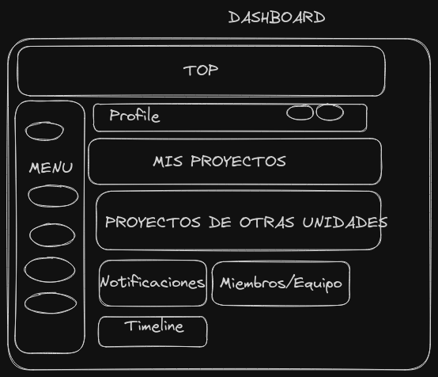
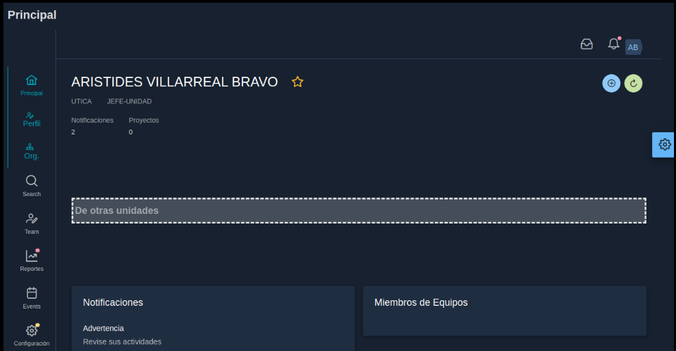
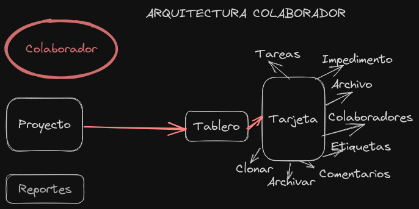

# 04. Manual del Colaborador

## Introducción

El sistema de flujo y gestión de tarjetas es una aplicación que se utiliza para gestionar proyectos y dar seguimiento a las acciones que deben ser realizar para cumplir con los requerimientos del proyecto.

Está orientado a equipos organizados que actúan trabajos basados en metas y objetivos claramente definidos. Ya que se requerirá establecer una planeación en periodos fijos de tiempo para alcanzar objetivos establecidos.

## Descargo de Responsabilidad

El sistema no está orientado a equipos no están organizados ni a equipos que no realizan planeación de actividades. 
Para equipos sin planeación o seguimiento de actividades, esta herramienta no es la solución recomendada.

## Objetivos

* Identificar los requerimientos de manera oportuna
* Registrar las actividades que desarrollan diariamente
* Dar seguimiento al trabajo de los colaboradores 
* Identificar necesidades 
* Registrar los impedimentos que afectan las labores
* Establecer un canal de comunicación entre departamentos
* Estudiar el comportamiento de actividades y realizar predicciones sobre el mismo.
* Conocer en tiempo real el estado de las actividades

## Dashboard

El diseño arquitectónico del sistema incluye en el Dashboard principal  los siguientes elementos que serán desplegados con base en los privilegios que posea el usuario dentro del sistema.

Al ingresar al sistema la primera vez , se puede encontrar con un dashboard vacio, esto indica que aun no se ha creado ningun proyecto con el que usted pueda trabajar.

Debería comunicarse con su jefe inmediato e indicarle que no tiene proyectos abiertos ni un plan sobre el que pueda trabajar.

Puede verificar que debajo de su nombre se muestra el perfil con el que ingreso al sistema.

Debajo de su nombre y perfil se mostrarán los proyectos en los que usted puede trabajar, en la parte inferior, donde se muestra el mensaje de Otras Unidades, se refiere a proyectos en los que usted no es miembro, pero que han sido establecidos como proyectos abiertos, y usted podrá crear acciones en ellos con ciertas limitaciones. Estos tipos de proyectos serán descritos más adelante.

## 04.01 Cambiar perfil
Usted puede cambiar datos generales de su perfil como nombre, teléfonos, fotos, password, entre otros, solo haciendo clic en el menú izquierdo Perfil o en la parte superior donde se muestran las iniciales de su nombre.

Cambie los datos que considere necesario de su perfil.
La  unidad y rol, solo pueden ser cambiados por el administrador del sistema, en caso de requerir esos cambios debe comunicarse con él.

## Arquitecura Modular
La arquitectura modular para el colaborador consiste de las acciones que él puede realizar sobre los diferentes componentes con el objetivo de alcanzar la funcionalidad esperada. A continuación se definen brevemente los componentes y pasos:
1. El colaborador al ingresar al sistema debe observar en el Dashboard principal los proyectos a los que ha sido asignado como colaborador o propietario. Si no se muestra proyectos, debe conversar con su jefe inmediato.

2. Una vez seleccionado el proyecto debe visualizar el botón Tablero que es donde se ejecutaran todas las acciones correspondientes. Las razones por las cuales no le aparece el tablero habilitado incluyen: No se ha abierto un Plan por parte del propietario del proyecto, el último plan abierto, su fecha de vencimiento es menor que la fecha actual. El proyecto ya ha finalizado.
3. Una vez en el tablero el podrá crear tarjetas siempre y cuando el propietario del proyecto indico que los colaboradores pueden crear tarjetas. Las tarjetas representan la acción a ejecutar.
4. Podrá ver las tarjetas asignadas por el jefe de unidad que se han establecido en la Reserva y el propietario las movió al plan actual.
5. El colaborador podrá administrar las tarjetas
6. Cuando se trata de un proyecto foráneo el colaborador que no pertenece a ese proyecto y es un proyecto público podrá crear tarjetas, pero con ciertas restricciones entre las que se incluyen no podrá crear tareas, no podrá mover las tarjetas a otras columnas,

## Plan

Es una iteración con un tiempo fijo establecido , generalmente 2 semanas o el tiempo que el equipo de trabajo acuerda.
En este periodo de trabajo el equipo estará realizando las actividades acordadas con el jefe de unidad  precisamente.
El sprint divide los requerimientos en pequeñas partes para que puedan ser realizadas  y medidas con mayor facilidad.

## Proyectos Foraneos
