# 04. Manual del Colaborador

```
Sistema de Flujo de Tarjetas

Versión: 1.0.b-4

Fecha: 3/julio/2023
```

## Introducción

El sistema de flujo y gestión de tarjetas es una aplicación que se utiliza para gestionar proyectos y dar seguimiento a las acciones que deben ser realizar para cumplir con los requerimientos del proyecto.

Está orientado a equipos organizados que actúan trabajos basados en metas y objetivos claramente definidos. Ya que se requerirá establecer una planeación en periodos fijos de tiempo para alcanzar objetivos establecidos.


## Descargo de Responsabilidad

El sistema no está orientado a equipos no están organizados ni a equipos que no realizan planeación de actividades. 
Para equipos sin planeación o seguimiento de actividades, esta herramienta no es la solución recomendada.


## Objetivos

* Identificar los requerimientos de manera oportuna
* Registrar las actividades que desarrollan diariamente
* Dar seguimiento al trabajo de los colaboradores 
* Identificar necesidades 
* Registrar los impedimentos que afectan las labores
* Establecer un canal de comunicación entre departamentos
* Estudiar el comportamiento de actividades y realizar predicciones sobre el mismo.
* Conocer en tiempo real el estado de las actividades


## Arquitecura Modular
La arquitectura modular para el colaborador consiste de las acciones que él puede realizar sobre los diferentes componentes con el objetivo de alcanzar la funcionalidad esperada. A continuación se definen brevemente los componentes y pasos:
1. El colaborador al ingresar al sistema debe observar en el Dashboard principal los proyectos a los que ha sido asignado como colaborador o propietario. Si no se muestra proyectos, debe conversar con su jefe inmediato.

2. Una vez seleccionado el proyecto debe visualizar el botón Tablero que es donde se ejecutaran todas las acciones correspondientes. Las razones por las cuales no le aparece el tablero habilitado incluyen: No se ha abierto un Plan por parte del propietario del proyecto, el último plan abierto, su fecha de vencimiento es menor que la fecha actual. El proyecto ya ha finalizado.
3. Una vez en el tablero el podrá crear tarjetas siempre y cuando el propietario del proyecto indico que los colaboradores pueden crear tarjetas. Las tarjetas representan la acción a ejecutar.
4. Podrá ver las tarjetas asignadas por el jefe de unidad que se han establecido en la Reserva y el propietario las movió al plan actual.
5. El colaborador podrá administrar las tarjetas
6. Cuando se trata de un proyecto foráneo el colaborador que no pertenece a ese proyecto y es un proyecto público podrá crear tarjetas, pero con ciertas restricciones entre las que se incluyen no podrá crear tareas, no podrá mover las tarjetas a otras columnas,


---
## Etapas  

Este manual se divide en 4 etapas 

# Etapa I  
  * Conocer el dashboard principal
  * Editar el perfil
  * Proyecto
  * Plan
  * Entender el uso del tablero
  * Crear tarjetas y sus elementos
  * Que hacer cuando otro usuario modifica nuestra tarjeta
  * Ver gráficas
  * Listado de tarjetas del plan
  * Cronología

# Etapa II  
  * Resumen del proyecto
  * Logros 
  * Email

# Etapa III  
  * Proyecto Foráneo
  

# Etapa V
  * Mis reportes Perfil Colaborador 

---
# Etapa I
  * Conocer el dashboard principal
  * Editar el perfil
  * Proyecto
  * Plan
  * Entender el uso del tablero
  * Crear tarjetas y sus elementos
  * Que hacer cuando otro usuario modifica nuestra tarjeta
  * Ver gráficas
  * Listado de tarjetas del plan
  * Cronología


## Dashboard

El diseño arquitectónico del sistema incluye en el Dashboard principal  los siguientes elementos que serán desplegados con base en los privilegios que posea el usuario dentro del sistema.


Al ingresar al sistema la primera vez , se puede encontrar con un dashboard vacio, esto indica que aun no se ha creado ningun proyecto con el que usted pueda trabajar.


Debería comunicarse con su jefe inmediato e indicarle que no tiene proyectos abiertos ni un plan sobre el que pueda trabajar.

Puede verificar que debajo de su nombre se muestra el perfil con el que ingreso al sistema.

Debajo de su nombre y perfil se mostrarán los proyectos en los que usted puede trabajar, en la parte inferior, donde se muestra el mensaje de Otras Unidades, se refiere a proyectos en los que usted no es miembro, pero que han sido establecidos como proyectos abiertos, y usted podrá crear acciones en ellos con ciertas limitaciones. Estos tipos de proyectos serán descritos más adelante.


## 04.01 Cambiar perfil
Usted puede cambiar datos generales de su perfil como nombre, teléfonos, fotos, password, entre otros, solo haciendo clic en el menú izquierdo Perfil o en la parte superior donde se muestran las iniciales de su nombre.


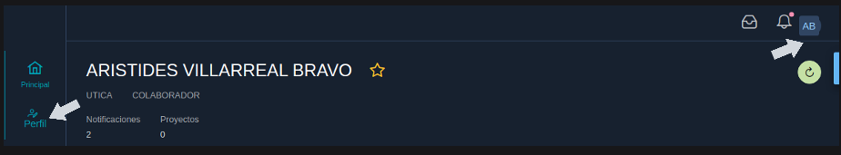

Cambie los datos que considere necesario de su perfil.
La  unidad y rol, solo pueden ser cambiados por el administrador del sistema, en caso de requerir esos cambios debe comunicarse con él.


## 04.02 Proyecto

Un proyecto en el sistema de flujo de tarjetas es la unidad de gestión que permite definir una serie de componentes y sus acciones a realizarse con la finalidad de lograr alcanzar objetivos definidos.
Estos proyectos deben ser asignados a uno o más departamentos, deben estar ubicados en una o más áreas. 
Los proyectos deben establecer una fecha de inicio y de fin, además de los colaboradores y propietarios del mismo.

Los proyectos se administran desde el dashboard principal y pueden ser privados o públicos.
En un proyecto privado tiene un alcance visible solo para los colaboradores y propietarios del mismo. Un colaborador de un proyecto privado solo puede ver las tarjetas que el mismo ha creado o que otro colaborador o jefe ha asignado.
En un proyecto público cualquier colaborador que no este asignado puede generar tarjetas con ciertas restricciones que una vez asignado al colaborador él puede interactuar con ellas.
Un propietario de un proyecto puede indicar si un colaborador puede o no crear tarjetas.
Los proyectos permiten gestionar un prefijo y un icono que ayuda a una rápida identificación del mismo.


## 04.03 Plan

Es una iteración con un tiempo fijo establecido, generalmente 2 semanas o el tiempo que el equipo de trabajo acuerda.
En este periodo de trabajo el equipo estará realizando las actividades acordadas con el jefe de unidad.
El plan divide los requerimientos en pequeñas acciones llamadas tarjetas que puedan ser medidas para generar estadística.
Un plan contendrá fecha de inicio y fin y los objetivos a alcanzarse.
Para utilizar el tablero es necesario contar con un plan abierto.
Cuando se cierra un plan se generan las estadísticas correspondientes.
El plan será creado por el jefe de unidad

## 04.04 Tablero

Es una herramienta visual que permite visualizar todo el trabajo que realiza el equipo con base en columnas.
Estas columnas representan las etapas en que se van ejecutando las diversas actividades.
Promueve la transparencia, comunicación y colaboración del equipo.

Desde el Dashboard principal en el proyecto deseado haga clic en el botón Tablero, recuerde que este botón solo se habilita si hay un **Plan** abierto para este proyecto.

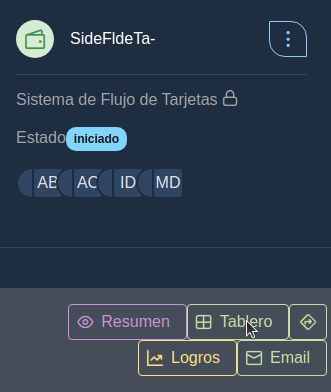

El tablero muestra tres columnas **pendiente**, **progreso** y **finalizado**.
* La columna pendiente muestra las tarjetas que no se han iniciado y están planificadas para realizarse en este plan.
* La columna progresó muestra las tarjetas que se están trabajando.
* La columna finalizada muestra las tarjetas que han finalizado.


## 04.05 Tarjeta

* Una tarjeta define requerimientos en término de las necesidades de los usuarios. 
* Una tarjeta indica la actividad a realizarse, quién o quienes la ejecutan, así como las tareas, impedimentos, comentarios, archivos, etiquetas que acompañan a la misma para describir de manera clara la actividad.

Algunas consideraciones la creación de tarjetas:
1. Propietario del proyecto puede crear tarjetas desde el tablero.
2. El colaborador puede generar tarjetas siempre y cuando el proyecto se estableció que el colaborador puede crear sus tarjetas.
3. Un colaborador externo puede generar tarjetas en el tablero con restricciones si es un proyecto abierto.
4. El colaborador podrá ver tarjetas que se le han asignado por los propietarios del proyecto creándolas desde el tablero o pasándolas desde la Reserva.
5. Un colaborador en un proyecto de tipo privado podrá solo ver sus tarjetas.
6. Un colaborador en un proyecto de tipo público podrá ver todas las tarjetas de ese proyecto, ya que existirán tarjetas que producen colaboradores foráneos al proyecto.


### 04.05.01 Crear Tarjeta


Proceda a crear una nueva tarjeta haciendo clic en el botón (+)

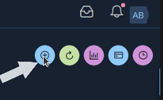

Se muestra el formulario donde podrá ingresar información específica sobre la nueva tarjeta, tales como tarjeta, tipo de tarjeta, prioridad, fecha final y la estimación.
Descripción de los elementos:  
**Tarjeta**: Es la acción a ejecutar, recomendación usar verbos para describir en forma breve la acción:
"Desarrollar formulario de ingreso de usuarios"  
**Tipo tarjeta**: Es la categoría donde estará asignada la acción, si no aparece en el listado el jefe de unidad puede crear nuevos tipos desde la opción Configuración--> Tipo tarjetas desde el menú principal.  
**Prioridad**: Indica el tipo de prioridad que se asigne a la tarjeta. Cada prioridad muestra un color de fondo diferente para cada tarjeta, de manera que se pueda identificar más rápidamente.  
**Fecha Final**: Es la fecha en que debe estar finalizando dicha tarea.  
**Estimación**": Es la estimación en horas y minutos **(99:99)** en la que debería llevarse a cabo la tarea. Ejemplo: 05:45 indica que esta tarea se debe realizar aproximadamente en 5 horas y 45 minutos. Rellene con ceros a la izquierda para completar dos dígitos de la hora y dos dígitos de los minutos.  


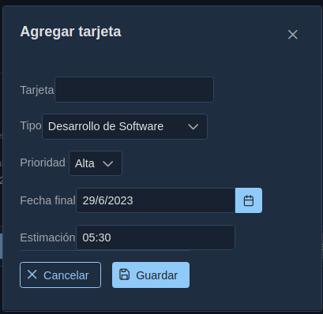


Luego de ingresar los datos, presione el botón Guardar, la tarjeta creada se muestra en la columna **pedientes**..  
Se puede observar que automáticamente se asignó como colaborador al usuario que creo la tarjeta, se asigna un icono de manera predeterminada, se muestra la duración en días para que finalice la tarjeta.(Esta duración no debe exceder la fecha final del plan).
Se habilita un menú desplegable (....) y en la parte inferior un botón para mover la tarjeta hacia la columna de progreso.


### 04.05.02 Cambiar nombre de la tarjeta

Para cambiar el nombre de la tarjeta se puede realizar de manera rápida dando doble clic en el nombre de la tarjeta, se habilitará el texto para que escriba sobre él y luego presione el botón de confirmación para aceptar los cambios.


De clic en el menú(...) para desplegar las diversas acciones que puede ejecutar sobre la tarjeta  
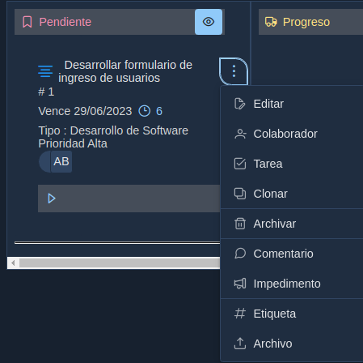  

### 04.05.03 Editar

Desde el menú de la tarjeta seleccioné la opción **Editar**

Se muestra el formulario para editar la tarjeta


Editar tarjeta permite hacer cambios a la tarjeta en los atributos: tarjeta, tipo de tarjeta, estimación, descripción, fecha final, prioridad e icono.
Es recomendable ingresar una descripción general que indique el tipo de trabajo a realizar en esta tarjeta. En el ejemplo agregamos una descripción y cambiamos el icono. 
Una vez finalizado los cambios, presioné el botón Guardar


Al dar clic en editar podemos observar los cambios realizados a la tarjeta.


  

### 04.05.04 Colaborador

Desde el menú de la tarjeta seleccioné la opción **Colaborador**


Es posible agregar o quitar colaboradores de la tarjeta, siempre y cuando estos colaboradores se hayan agregado previamente al proyecto.
Solo debe dar doble clic en la casilla de selección del colaborador y una vez marcados los colaboradores, haga clic en el botón Guardar. 
Para remover un colaborador solo tiene que desmarcar la casilla.


Se puede observar que aparece el nuevo colaborador agregado a la tarjeta. Se mostrará la foto del colaborador que agrego desde su perfil o en caso de no poseer foto se generará un avatar con las siglas de su nombre. Usted puede colocar el mouse sobre el avatar y mostrará el nombre completo del colaborador.
No hay límites en la cantidad de colaboradores que pueden estar asignados a una tarjeta.

Los colaboradores asignados a la tarjeta reciben un correo de notificación.

### 04.05.05 Tarea

Una **tarea** es una unidad de trabajo necesaria para culminar la realización de una tarjeta. 

Desde el menú de la tarjeta seleccioné la opción **Tarea**


Ingrese la tarea a realizar y presione el botón (+), se agregará a la lista de tareas.


Se muestra la tarea, presioné el botón cerrar para confirmar los cambios en la tarea. Usted puede agregar múltiples tareas y también eliminarlas presionando el botón (x)


En la tarjeta se muestra información del número de tareas pendientes /tareas totales. Agregue nuevas tareas a la tarjeta.


En la tarjeta se muestra información del número de tareas pendientes /tareas totales. Agregue nuevas tareas a la tarjeta haciendo clic en la casilla de total de tareas o desde el menú Tareas.

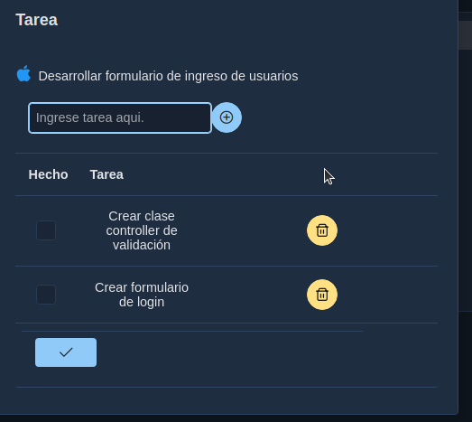

Si usted desea cambiar el texto de la tarea de doble clic sobre el nombre de la misma y escriba el texto deseado.


### 04.05.06 Mover tarjetas

Proceda a mover la tarjeta a la columna de progreso haciendo clic en el botón (-.>) en la parte inferior de la tarjeta.

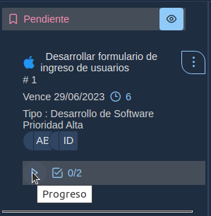

Se muestra la columna progreso con la tarjeta.


Usted no podrá mover tarjetas a la columna finalizada hasta que no haya completado las tareas.

Cuando una tarjeta está en la columna progreso, esta puede ser regresada a la columna **pendiente** o avanzar a la columna **finalizado**

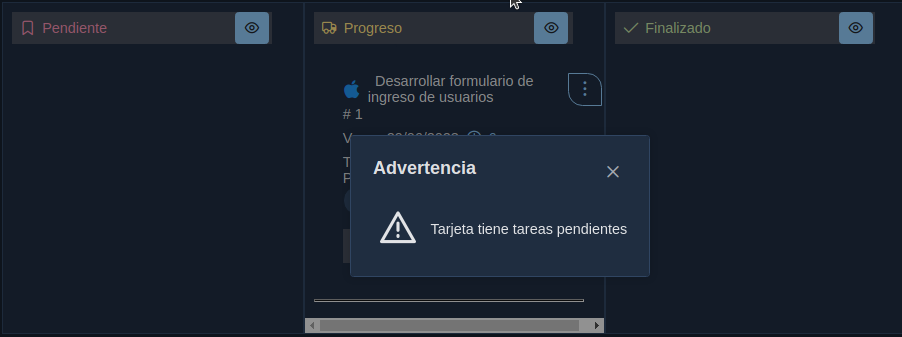


### 04.05.07 Marcar terminada una tarea

Para indicar que ha finalizado una  tarea, abra el diálogo de tarea de la tarjeta y marque la casilla de selección y presione el botón cerrar.
Las tareas que se marquen como terminadas se mostraran de color verde la próxima vez que ingrese.


Se actualiza, automáticamente, el contador de tarea pendiente


si regresa nuevamente al diálogo se mostrará en color verde la tarea terminada


proceda a marcar la otra tarea como finalizada.

Se puede observar que ya no tenemos tareas pendientes 0/2 y es posible mover la tarjeta a la columna finalizada.


### 04.05.08 Clonar

Clonar una tarjeta es el proceso mediante el cual se crea una nueva tarjeta a partir de una creada previamente.

Desde el menú de la tarjeta seleccioné la opción **Clonar**


El formulario muestra el nombre anterior de la tarjeta desde la cual se va a realizar la clonación, reemplace el nombre por uno nuevo y presione el botón Clonar, los elementos de la tarjeta serán copiados a esta nueva tarjeta.  
**Ejemplo**: Crear opciones de menú


Proceda a editar la imagen y cámbiele la prioridad a **Media** y el icono y guarde los cambios.


La tarjeta cambiará de color basándose en la prioridad establecida.

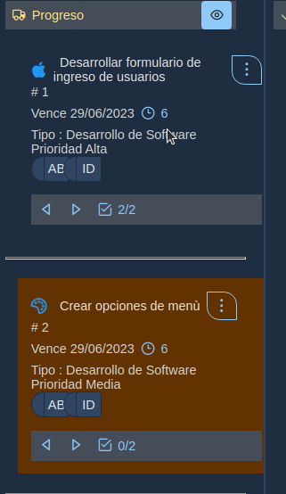


### 04.05.09 Archivar 
La opción de archivar nos permite remover una tarjeta del tablero y del proyecto.  Estas tarjetas no serán utilizadas nuevamente.

Desde el menú de la tarjeta seleccioné la opción **Archivar**


Si desea archivar la tarjeta presione el botón eliminar, se mostrará un diálogo solicitando confirmación de la acción. Tenga presente que este es un proceso no reversible.
Sí selecciona Archivar esta tarjeta será eliminada del tablero.


### 04.05.10 Comentario   
Los comentarios permiten definir información genérica que ayuda a entender procesos y eventos que están ocurriendo en una tarjeta. Además, es un medio para establecer un canal de comunicación entre los participantes de una tarjeta.


Desde el menú de la tarjeta seleccioné la opción **Comentario**


Para agregar un comentario, simplemente coloque el texto deseado y presione el botón (+)


Para agregar un comentario, simplemente coloque el texto deseado y presione el botón (+)
Usted puede editar el comentario agregado haciendo clic en el nombre del mismo o puede eliminarlo haciendo clic en el botón eliminar. 
Al finalizar de clic en el botón Cerrar.

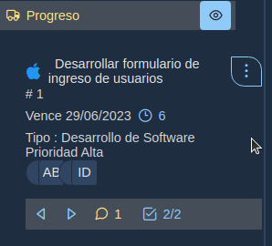

En la parte inferior de la tarjeta se muestra el total de comentarios que se han creado para esa tarjeta, usted puede verlos haciendo clic en el botón que muestra el número de comentarios o mediante el menú (...) Comentarios  


### 04.05.11 Impedimiento  
Los impedimentos son eventos o requerimientos que afectan la realización de actividades para cumplir el objetivo establecido en la tarjeta.

Desde el menú de la tarjeta seleccioné la opción **Impedimento**

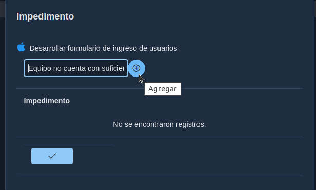

Registre el impedimento que esté afectando su labor de clic en el botón (+).


Presione el botón Cerrar para cargar los impedimentos a la tarjeta.


En la tarjeta se muestra el total de impedimentos, de manera que al hacer clic sobre el total de impedimentos o mediante el menú (...) Impedimento se puede mostrar el listado, permitiendo agregar, editar o eliminar los impedimentos de la tarjeta.


### 04.05.12 Etiqueta  

Las etiquetas se usan para establecer categorías de las tarjetas dentro del tablero, de manera que permitan su identificación de manera oportuna.

Desde el menú de la tarjeta seleccioné la opción **Etiqueta**

Puede observar que el formulario posee la misma funcionalidad que los formularios vistos con anterioridad, ingrese el texto de su etiqueta y presione el botón (+), una vez que este en la lista en la columna **Severidad**, de doble clic y se mostrara una lista de opciones que permiten establecer la severidad de su etiqueta que se convierte en un color para la misma dentro de la tarjeta.


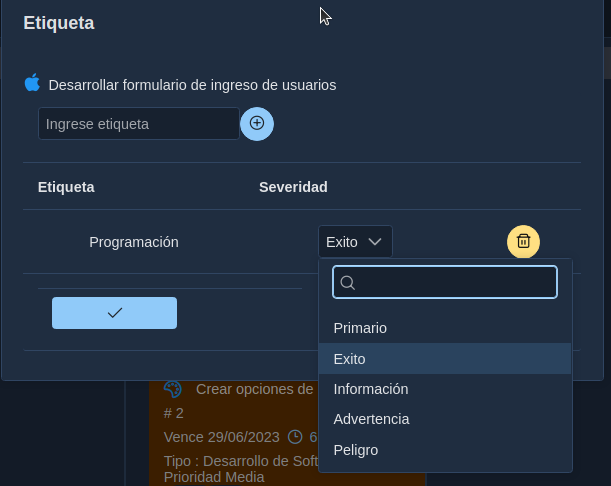

Presione el botón Cerrar, y se muestra en el tablero la tarjeta con la etiqueta creada.


Usted puede editar, agregar y eliminar etiquetas ingresando desde el menú (...) Etiqueta.


### 04.05.13 Archivo

Los archivos pueden ser documentos e imágenes que ofrecen mayor información sobre la tarjeta o eventos relacionados con ella.

Desde el menú de la tarjeta seleccioné la opción **Archivo**


Se muestra en la lista el nombre del archivo, si usted desea puede dar doble clic sobre el nombre y lo puede editar. También se encuentra el botón Eliminar y el botón para descargar el archivo.

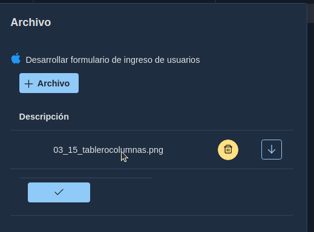

Haga clic en el botón cerrar para mostrar la tarjeta, puede observar la cantidad de archivos que posee la tarjeta.

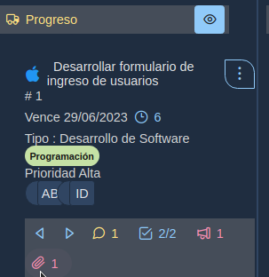

---

### 04.05.15 Tarjetas editadas por otros ususarios

El tablero, una tarjeta puede ser editada de manera simultánea por varios colaboradores. Para conservar la integridad de la tarjeta y evitar que un colaborador escriba sobre los cambios de otro colaborador sin haberlos visto antes, se implementa un evento en el sistema que permite verificar si la tarjeta fue cambiada por otro colaborador mientras usted trabajaba en ella, de manera que al ocurrir esta situación usted recibirá una notificación informando que la tarjeta fue cambiada por otro usuario y es necesario que usted actualice el tablero primero para que obtenga la tarjeta actualizada con los cambios realizados por otro colaborador y ahora si podrá usted modificarla y se evita los conflictos de sincronización.


**Ejemplo 1**:
Colaborador Arístides e Israel ingresan cada uno a su sesión y ambos toman la misma tarjeta para agregar algún elemento.
Aristides edita la tarjeta cambiando la descripción y aún no ha presionado el botón guardar mientras Israel en su sesión agrega una nueva tarea y presiona el botón para guardar la tarea.
Cuando Aristides intente guardar sus cambios en la misma tarjeta, se envía el siguiente mensaje:


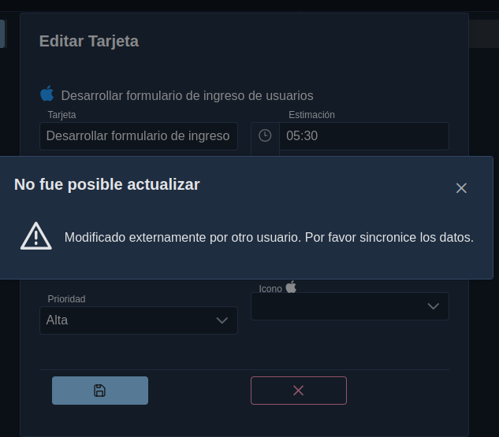

Proceda a cerrar el diálogo y queda en el formulario de edición, proceda a cerrar el formulario sin intentar guardar sus cambios, estos no será posible guardarlos, ya que afectaría la integridad de los datos.


Observe que cuando usted cierra un formulario este sincroniza con la base de datos y se puede observar en el contador de tareas que ahora en lugar de 2 tareas existe una tercera que fue creada por el colaborador Israel en su sesión.


**Ejemplo 2**:

Ahora imaginemos que mientras nosotros nos mantenemos en nuestro tablero, el colaborador Israel agrega una etiqueta la tarjeta. Aristides no ha actualizado su tablero y desea editar la tarjeta, se va a generar el mensaje:


Esto indica que mientras usted tenía el tablero abierto no había realizado ninguna acción sobre esta tarjeta, otro colaborador la modifico, por lo tanto, debemos obtener esa sincronización primero para poder trabajar con esta tarjeta.


Proceda a sincronizar su tablero en la parte superior de clic en el botón Actualizar, y su tablero se sincronizará con la base de datos y se mostrará con las últimas actualizaciones realizadas.


Puede observar que su tablero está actualizado, la tarjeta muestra la etiqueta que agrego el otro colaborador, y ahora podemos trabajar con esa tarjeta.


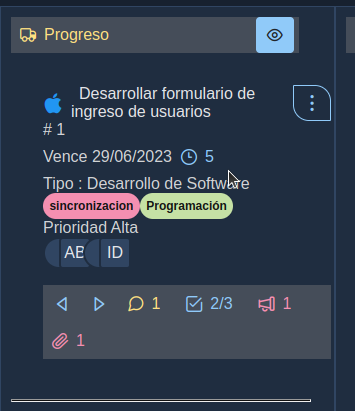

Lo explicado en esta sección muestra como se administra la sincronización de las tarjetas para mantener su integridad al ser utilizada por varios colaboradores.

---

### 04.06 Graficas

Las gráficas nos permiten visualizar el estado actual del tablero para el plan 
Actual. Permite identificar los totales de tarjetas en las columnas pendientes, 
progreso y finalizado.

De clic en el botón Gráfica en la parte superior del tablero   


Se observa la gráfica por cada columna indicando los totales de tarjetas.  
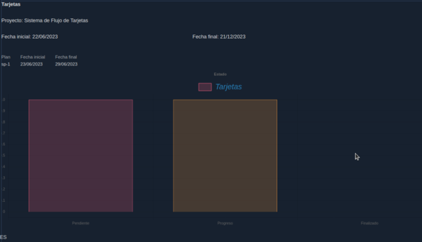

Para regresar al **tablero** en la parte superior izquierda de clic en Tablero


### 04.07 Tarjetas

Muestra un Listado de las tarjetas del plan actual, permitiendo imprimir el listado de las mismas.

De clic en el botón tarjetas en la parte superior del tablero  


Se muestra el listado de las tarjetas del plan, en la parte superior de la tabla puede imprimir las tarjetas presionando el botón Imprimir.  
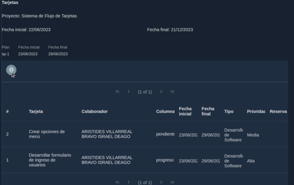

Se despliega en otra pestaña del navegador su informe listo para ser impreso al presionar el botón Imprimir.  
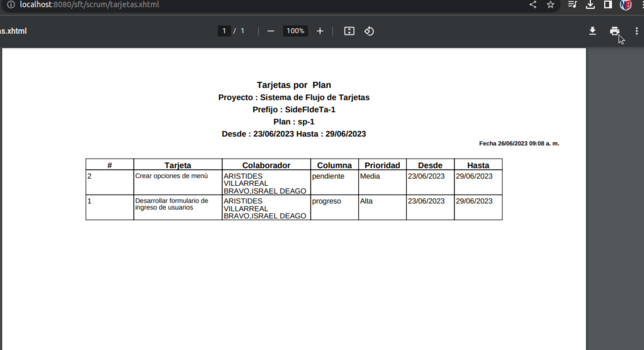  
Regrese a la pestaña donde se mantiene el sistema activo y de clic en el menú Tablero en la parte superior para regresar al tablero.


### 04.08 Cronología

Permite visualizar cronológicamente las tarjetas del plan actual. Para ayudar a la toma de decisiones.


Practique creando una nueva tarjeta llamada: **Pruebas de opciones de menú**. Mueva a la columna **finalizado** la tarjeta **Desarrollar formulario de ingreso de usuarios**, proceda a mover la tarjeta 
**Crear opciones de menú** a la columna **progreso** 

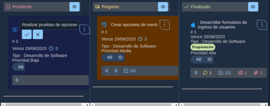

En la parte superior del tablero de clic sobre el botón cronología.  
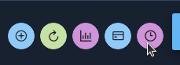


Espere unos segundos mientras se procesa la información, se muestra la cronología por colaborador. Puede regresar al tablero haciendo clic en el botón Tablero en la parte superior del formulario.

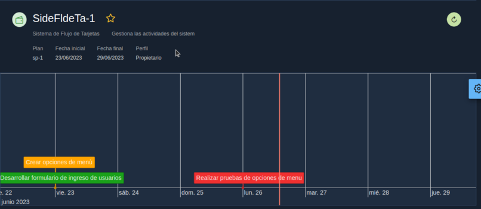

Puede observar que las tarjetas en la columna **pendiente** se colocan de color rojo, las de la columna **progreso** en color amarillo y las que están en la columna finalizada se colocan de color **verde**.

Para regresar al tablero de clic en el botón **Tablero** en la parte superior izquierda.  

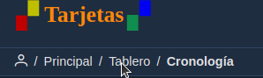


---
# Etapa II
  * Resumen del proyecto
  * Logros 
  * Email


## Resumen del proyecto

 El resumen del proyecto muestra el total de planes, tarjetas pendientes en progreso y finalizados, además de las tarjetas que se encuentran en reserva.

Desde el dashboard principal seleccioné el proyecto y de clic en el botón **Resumen**, se muestra un diálogo con el resumen del proyecto. Esto le permitirá identificar el estado actual del plan.  

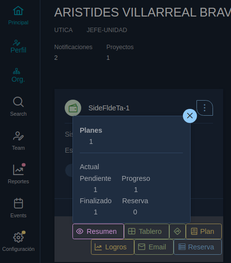


## Logros

Los logros es la gráfica que muestra la estadística de todos los planes cerrados del proyecto, permitiendo al jefe de unidad tomar decisiones sobre el progreso del mismo a través del tiempo.

En el dashboard principal seleccione el proyecto deseado y presione el botón **Logros**

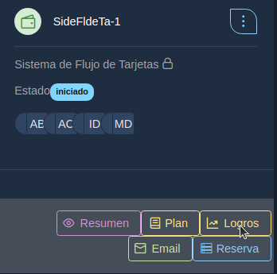


Puede ver la gráfica de totales y su porcentaje por plan y de las columnas pendientes, progreso y finalizado.

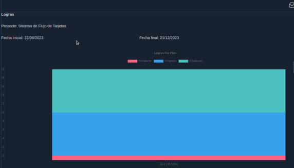

Regrese al menú principal dando clic en la opción principal del menú superior izquierdo

Nos muestra el formulario de tarjetas del plan, y si desea puede imprimirlas dando clic en botón Imprimir

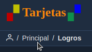

Al dar clic en el botón imprimir se despliega en otra ventana el informe.


## E-mail

El sistema permite enviar email a los colaboradores del proyecto, usted puede indicar a qué colaboradores será enviado el correo y adjuntar archivos.
Es útil para enviar aviso cómo por ejemplo: de una reunión, o que está pronto a finalizar un plan, entre otros eventos.

Desde el dashboard principal seleccioné el proyecto deseado y de clic en el botón **Email**  


Ingrese el título y texto del email a enviar, puede adjuntar un archivo al correo


En la pestaña **Destinatario**, seleccione los usuarios que recibirán el correo.
Proceda a dar clic en el botón enviar para que el email sea enviado a los usuarios seleccionados.

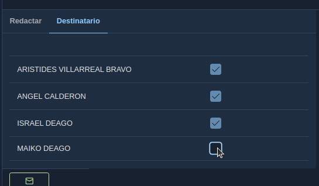


---
# Etapa III    
* Proyectos Foráneos  


## Proyectos Foráneos

 Los proyectos foráneos son proyectos que han sido declarados como público, y que usted no ha sido asignado como colaborador ni propietario del mismo.
Lo crean las unidades para que otros departamentos puedan hacer solicitudes y ellos procesar estás solicitudes.
Estos se muestran en la sección **De otras unidades**


**Ejemplo:**
El departamento Utica el jefe de unidad crea un proyecto público llamado Solicitudes de Utica-2023, en el que agrega como colaborador Israel, Malko, Aristides. Además genera el plan para ese proyecto.

La licenciada Astrid ingresa al sistema ,puede observar que en la lista de proyectos **De otras unidades**, se muestra el proyecto Solicitudes de Utica-2023, el color es diferente a los proyectos en que el colaborador está asignado. El proyecto tiene un plan activo para las fechas en que ha ingresado el usuario, por lo que se muestra el botón **Tablero**, el usuario da clic en el botón para ir al Tablero y crear una nueva tarjeta de solicitud para ese proyecto.

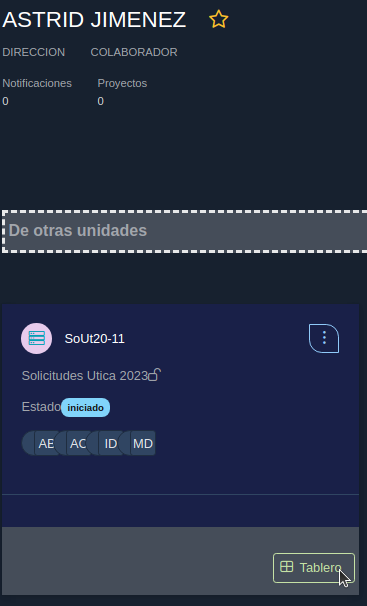

En el tablero el colaborador da clic en el botón **(+)** para agregar una nueva tarjeta

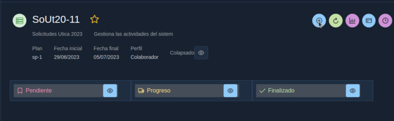

Agrega una tarjeta nueva **La impresora del CELA no está funcionando adecuadamente**, indicando el tipo de tarjeta **Reparación de Impresora**, coloca la estimación y fecha final para reportar el problema con la impresora

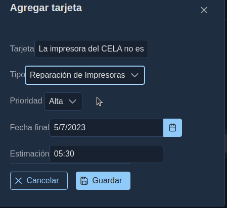


Al dar clic en Guardar la tarjeta se envía un email al propietario del proyecto indicando que un usuario foráneo ha creado una nueva tarjeta solicitando un servicio


El tablero para un colaborador foráneo tiene restricciones, las tarjetas no se pueden mover de columnas y las únicas acciones que puede realizar es editar, agregar comentarios o subir archivos.
Para tarjetas foráneas los comentarios es una forma rápida de comunicarse con el equipo asignado al proyecto

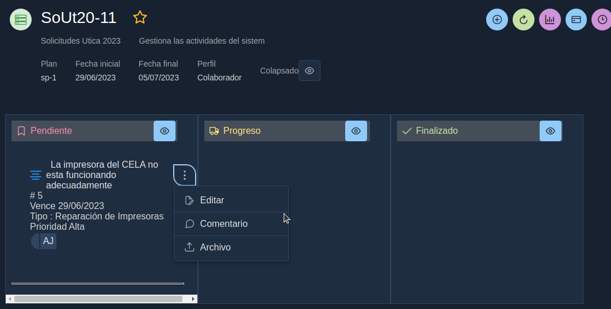


Ahora un miembro del equipo ingresa al sistema y se dirige al tablero de Solicitudes Utica-2023 y puede observar que se muestra la tarjeta creada por el usuario Astrid. Da clic derecho en la tarjeta y selecciona la opción **Colaborador**, para agregar el colaborador que va a atender la solicitud.

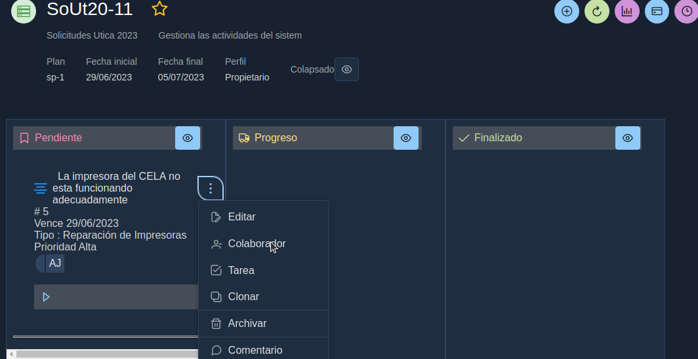

Ahora se muestra el colaborador asignado a la tarjeta, el usuario que lo solicito puede ver que hay un nuevo colaborador. Desplace la tarjeta a la columna **Progreso** 

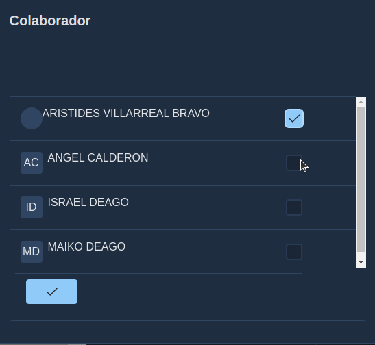

ingrese un comentario para avisar al usuario solicitante que se está trabajando en la tarjeta


Al ingresar el usuario Astrid puede ver en su tablero que la tarjeta está en la columna **Progreso** y tiene un comentario, el usuario puede responder a ese comentario como una forma de comunicarse con el equipo que está trabajando en la tarjeta

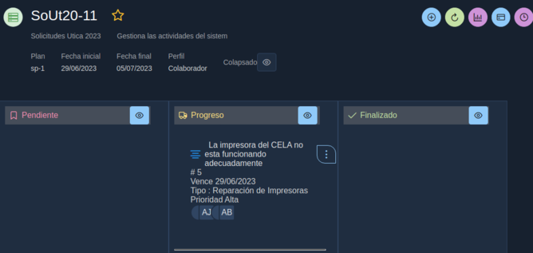


De esta manera se puede administrar los proyectos foráneos y establecer un canal de comunicación entre colaboradores de un proyecto y solicitantes.


---

# Etapa V

  * Mis reportes Perfil Colaborador 

## Mis reportes Perfil Colaborador 

Muestra los proyectos en los que este asociado al usuario que inicio sesión permitiendo:
* Imprimir informes de todos los proyectos en que ha colaborado
* Imprimir las tarjetas que ha trabajado en el proyecto seleccionado
* Ver un resumen del proyecto en su estado actual
* Visualizar los logros alcanzados en el proyecto seleccionado por plan
* Visualizar las estadísticas por planes cerrados
* Visualizar estadística por colaborador del proyecto seleccionado.

Desde el menú Reportes --> Proyectos seleccioné Mis Reportes

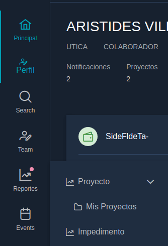

Se muestra el listado de proyectos, si desea puede imprimirlos todos haciendo clic sobre el botón **Imprimir** en la parte superior de la lista

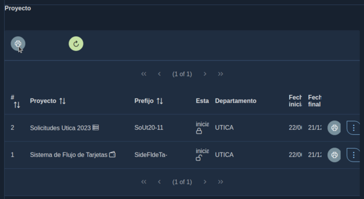

Se genera en una nueva ventana el informe para impresión

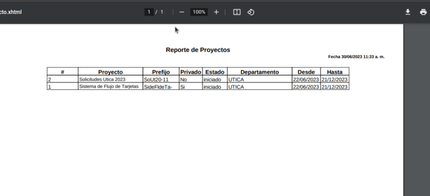


Si desea imprimir el informe individual, seleccione el proyecto y de clic en el botón **Imprimir**

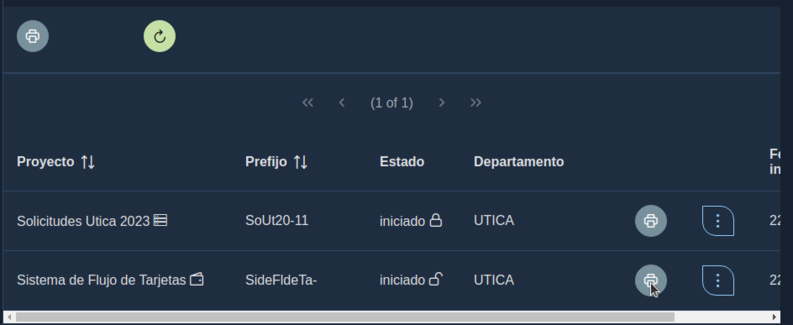


muestra el informe del proyecto seleccionado


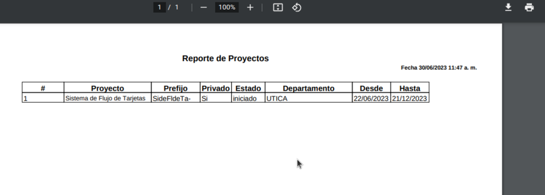

Se muestra el menú con las diversas opciones:

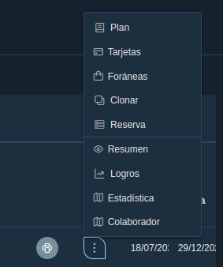

Seleccione opción **Tarjetas**

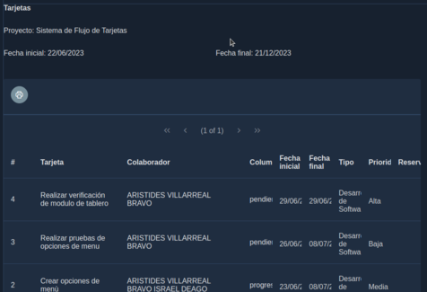

Regrese al listado de proyectos dando clic en **Mis proyectos** en la esquina superior izquierda

```
/Mis Proyectos/Tarjeta

```

De clic en el botón **Resumen** para ver el resumen del proyecto

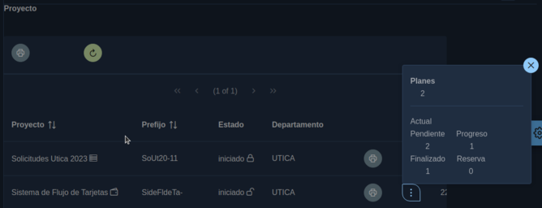

De clic en la opción **Logros** para mostrar los logros alcanzados

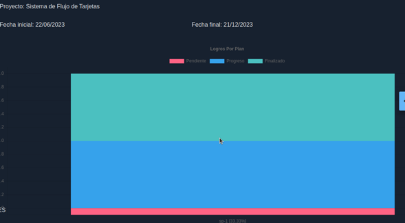

Regrese al listado de proyectos dando clic en **Mis proyectos** en la esquina superior izquierda

```
/Mis Proyectos/Logros

```

Seleccione la opción **Estadística** ,para mostrar la estadística del proyecto

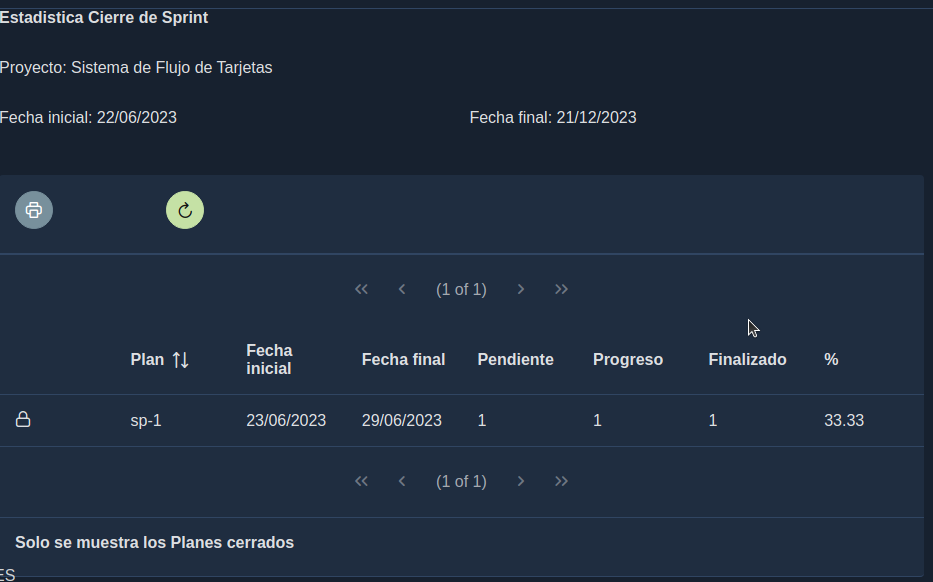

Regrese al listado de proyectos dando clic en **Mis proyectos** en la esquina superior izquierda

```
/Mis Proyectos/Estadística

```

Ahora seleccione la opción **Colaborador** para ver las estadísticas por colaborador


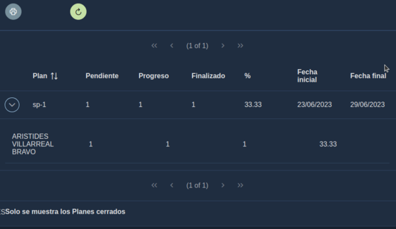


---

## Buscar Tarjetas

Para buscar tarjetas como jefe de Unidad o autoridad, debe tener presente que debe haber establecido el organigrama para el departamento si desea visualizar tarjetas de sub departamentos.

Desde el menú izquierdo seleccioné la opción Buscar

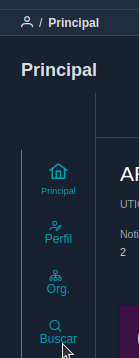

Todas las tarjetas serán filtradas con estas condiciones:
 Departamento + Proyecto + (Filtro que usted seleccione)


Entre los filtros que usted puede indicar se encuentran:


* Tarjeta: Ingrese cualquier parte del texto del nombre de la tarjeta
* Descripción:Ingrese cualquier parte del texto de la descripción de la tarjeta
* Colaborador: Seleccione el colaborador para buscar sus tarjetas
* Prioridad : Indique la prioridad de las tarjetas a buscar
* Columna: Seleccione la columna de las tarjetas que desea buscar
* Depósito: Seleccione si desea mostrar las tarjetas en el tablero o en reserva
* Rango entre fechas : Especifique el rango de fechas entre los que desee buscar las tarjetas. Se tomará en cuenta la fecha de inicio de las tarjetas.


La funcionalidad es muy básica, seleccione las condiciones a filtrar y se mostrará un listado con los resultados y en la parte inferior se muestra el filtro aplicado.

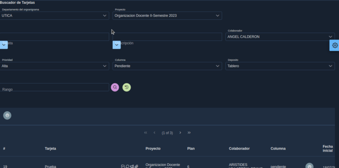

En la parte inferior se muestra el listado de documentos que cumplan con la condición especificada

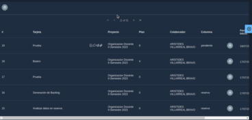

Al dar clic en el botón de la tarjeta deseada puede observar el detalle de la tarjeta


Al dar clic en el botón, imprimir en la parte superior, se imprime un listado de todos las tarjetas

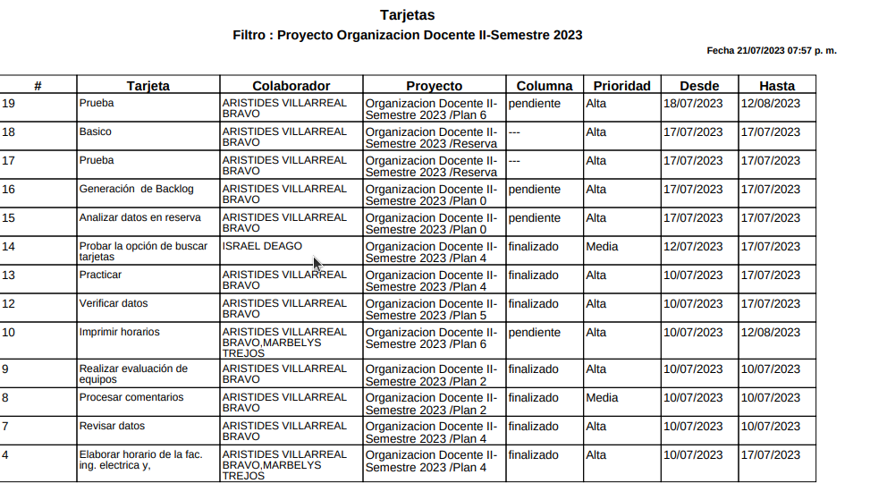

