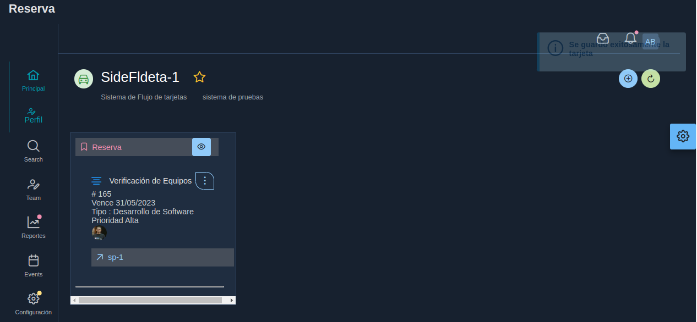

# 07. Backlog

El propietario del proyecto asigna tarjetas a los colaboradores

## Envio de emails
* Cuando se asigna o remueve una colaborador de una tarjeta este recibe un email con la notificación correspondiente.
* Cuando se pasa una tarjeta de la reserva a un tablero se envia emails
* 

