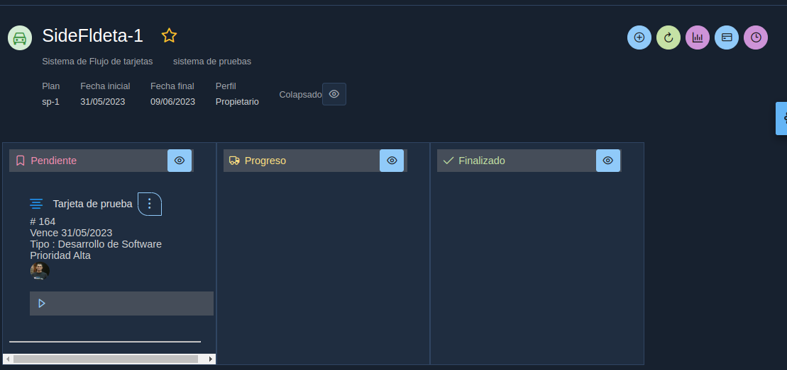

# 07. Tablero

El tablero permite gestionar las tareas de los colaboradores.

## Envio de emails
* Cuando se asigna o remueve una colaborador de una tarjeta este recibe un email con la notificación correspondiente.
* Cuando es un usuario foraneo que crea una tarjeta se envia email al propietario del proyecto
* Cuando es una tarjeta foranea cada vez que hay un comentario publico se envia un correo a los colaboradores.
* 
## usuariop foraeno
EL usuario foraneo siempre se almacena en al posición cero

